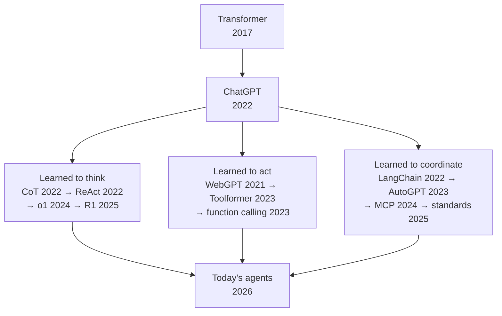
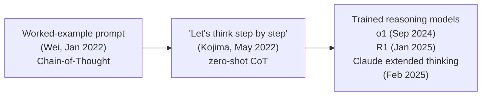
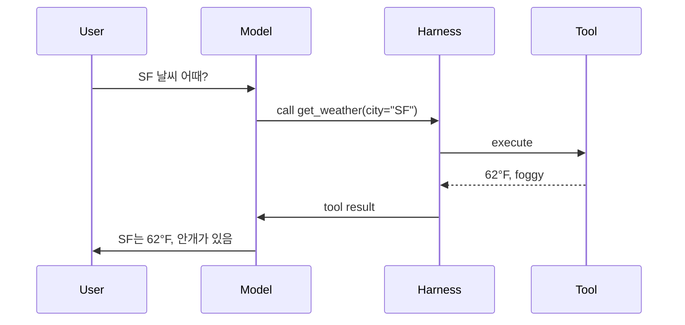
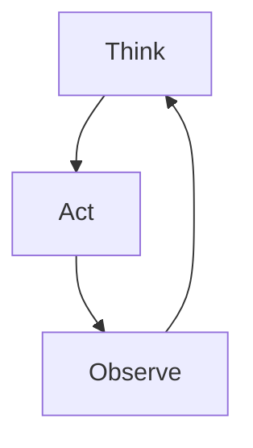
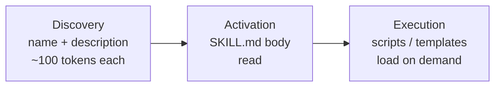
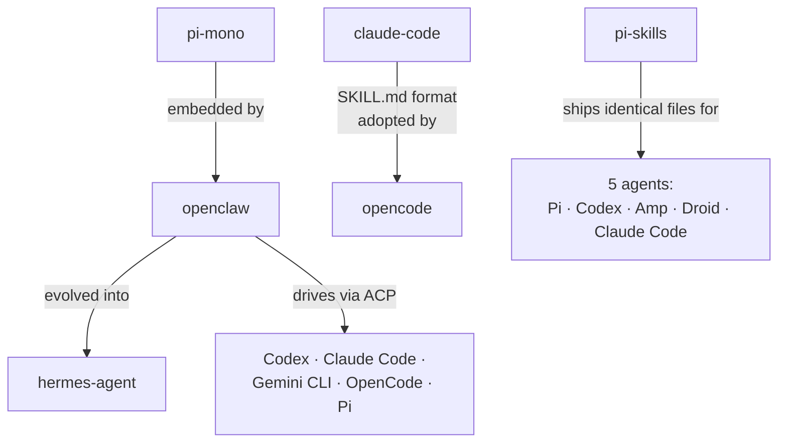
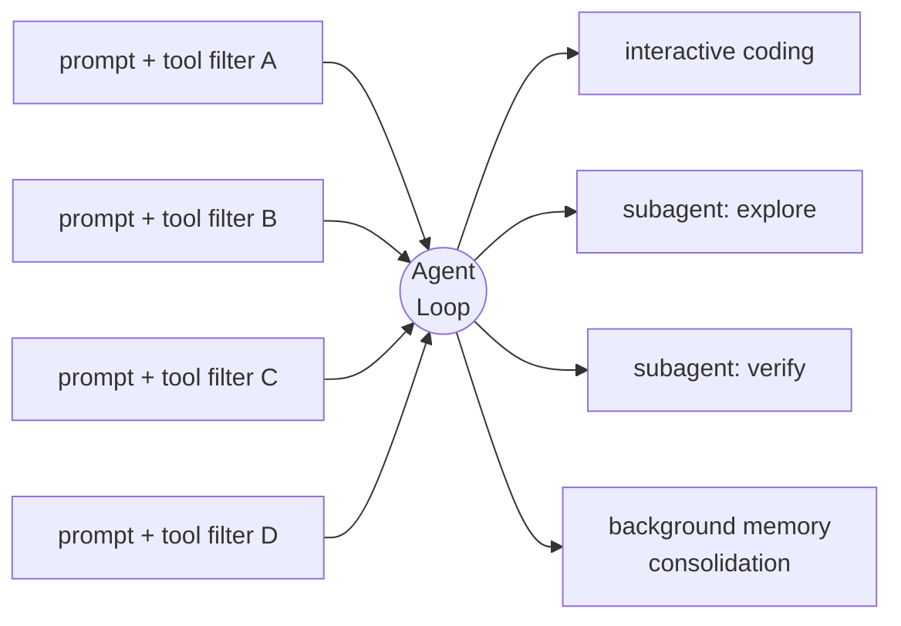

<!-- _class: lead -->

# Modern AI Agents

#### 역사, 구조, 그리고 editorial choices

<br>

발표자 · 2026-05

<!--
[발표 시 짚을 포인트]
- 자기소개는 한 문장. 이 talk 자체가 credential 역할을 한다.
- 시간: 35~40분. 질문은 마지막에 받는다.
- 목표: 이 talk이 끝날 때 오늘날의 AI agents가 무엇이 다르고 어떻게 골라야 하는지 정리할 수 있다.
- AI 사전 지식은 필요 없다. 용어는 진행하면서 정의한다.

[전달 메모]
- 초반은 천천히. 후반으로 갈수록 페이스를 올린다.
-->

---

<!-- _class: lead -->

## Agent의 역사 — 세 흐름의 수렴



<!--
[발표 시 짚을 포인트]
- 오늘날의 agents는 단일 발명품이 아니다. 세 갈래가 병렬로 발전한 결과다.
- 공통 기반은 두 가지다. Transformer architecture (2017)와 chat-model interface (ChatGPT, 2022).
- 그 위에 세 갈래가 거의 동시에 자랐다.
  - reasoning이 별도의 출력 channel로 발전 (CoT → ReAct → o1 → R1)
  - tool use가 protocol로 표준화 (WebGPT → Toolformer → function calling)
  - 그 둘을 묶는 framework가 등장하고, 이어 cross-vendor standards로 정착 (LangChain → AutoGPT → MCP → ACP/SKILL.md/AGENTS.md)
- 세 흐름이 오늘날의 agents로 수렴한다.
- 이 도식이 talk의 전체 구조를 나타낸다. 각 branch가 이후 한 section에 대응한다.

[전달 메모]
- diamond 모양인 이유를 짚는다. linear timeline으로 그리면 사실과 맞지 않는다. CoT (2022.01)는 ChatGPT (2022.11)보다 먼저, WebGPT (2021.12)는 그보다 더 먼저다. 세 갈래는 순차가 아니라 병렬이다.
-->

---

<!-- _class: lead -->

## Thesis

<br>

> ### 2026의 AI agents는<br>**합의한 것이 더 많고**<br>**남은 차이는 *editorial*이다**

<!--
[발표 시 짚을 포인트]
- talk의 결론을 먼저 제시한다. 청중이 도착 지점을 알면 인지 부담이 줄어든다.
- "editorial"의 의미: 각 project가 *무엇을 거부하는가*, *무엇을 표준화하는가*, *trust boundary를 어디에 긋는가*, *agent가 자기 자신을 수정해도 되는가*에 대한 선택.
- architecture는 안정됐다. 남은 disagreement는 capability 차이가 아니라 선택 차이다.
- 이 슬라이드부터 슬라이드 23까지의 모든 내용이 이 주장을 뒷받침한다.

[전달 메모]
- 지금 defense하지 않는다. 나머지 슬라이드가 defense다.
-->

---

# Completion에서 instruction으로

<div class="cols-2">
<div class="card">

**~ 2020**

<br>

<div class="mono">"오늘 날씨는..."</div>

<br>

다음 단어를 예측하는<br>autocomplete 모델

</div>
<div class="card blue">

**2022 ~**

<br>

<div class="role-box">
<span class="role">user:</span> 메일 정리해줘
</div>
<div class="role-box">
<span class="role">assistant:</span> 어떤 기준으로?
</div>

<br>

instruction을 받아 처리하는<br>chat 모델

</div>
</div>

<div class="callout">
scale + instruction tuning + RLHF — 2020~2022
</div>

<!--
[발표 시 짚을 포인트]
- 2020년 이전의 language model은 다음 단어를 예측하는 autocomplete였다.
- GPT-3 (2020)에서 한 가지가 확인됐다. scale이 충분히 커지면 같은 architecture가 자연어 instruction을 따른다.
- 이 변화에는 세 가지가 작용했다.
  - **scale** — parameter와 data 모두 한 자릿수 이상 증가
  - **instruction tuning** — "instruction을 따르라"는 예시로 fine-tuning
  - **RLHF** — 인간이 선호한 답을 reward로 학습
- 변화의 본질은 architecture가 아니라 interface다. 모델 구조는 그대로, 사용자가 모델과 상호작용하는 방식이 달라졌다.
- ChatGPT (2022.11.30)는 이 변화가 외부에 가시화된 시점이다.

[전달 메모]
- Transformer 내부 구조나 scaling law는 다루지 않는다. 이 슬라이드의 메시지는 하나다 — completion에서 instruction으로의 전환.
-->

---

# Chat model의 세 가지 role

<br>

<div class="role-box">
<span class="role">system:</span> 모델에게 주는 규칙 (사용자에게 보이지 않음)
</div>

<div class="role-box">
<span class="role">user:</span> 사용자 입력
</div>

<div class="role-box">
<span class="role">assistant:</span> 모델 응답
</div>

<br>

<div class="callout">
모든 chat model의 universal API — Claude, ChatGPT, Gemini, Llama 동일
</div>

<!--
[발표 시 짚을 포인트]
- 모든 chat-tuned model이 동일한 세 가지 role을 사용한다. universal API다.
- **system** — 사용자에게 보이지 않는 instruction (규칙, persona).
- **user** — 사용자 입력.
- **assistant** — 모델 응답.
- OpenAI ChatGPT API (2023.03)에서 처음 도입된 format이 Anthropic, Google, Meta, Mistral, 그리고 모든 open-weight chat template로 확산됐다.
- 이후 talk에서 다루는 tool use, reasoning, agents는 모두 이 세 role frame 안에서 일어난다.

[전달 메모]
- 여기가 vocabulary checkpoint다. 이 슬라이드 이후로는 "system prompt", "tool message" 같은 용어를 별도 설명 없이 사용한다.
-->

---

# Reasoning이 별도 output channel이 되다



<div class="callout">
final answer와 thinking trace가 분리된 두 channel로 출력된다
</div>

<!--
[발표 시 짚을 포인트]
- reasoning 능력의 발전은 두 단계로 정리된다.
- **1단계: prompt 기법.** Wei et al. (2022.01)이 worked-example 방식 (Chain-of-Thought)을 제안했다. prompt에 reasoning 예시를 포함하면 모델이 같은 형식으로 응답하면서 math/logic 성능이 향상된다. Kojima et al. (2022.05)은 더 단순한 방법을 보였다. "Let's think step by step"만 추가해도 zero-shot으로 같은 효과가 난다.
- **2단계: trained capability.** 2024.09 OpenAI o1이 reinforcement learning으로 긴 internal reasoning을 학습한 첫 모델이다. 2025.01 DeepSeek-R1이 open-weights로 동급 성능을 재현했다. 2025.02 Claude가 extended thinking mode를 추가했다.
- 결과: reasoning이 별도의 output channel로 분리됐다. 현대 모델은 thinking trace와 final answer를 별개로 출력하며, 각각의 비용과 용도가 다르다.
- 메커니즘: 중간 token이 forward pass에 추가 compute를 제공하고, context window를 working memory처럼 사용하게 한다.

[전달 메모]
- "reasoning"이 새로운 종류의 지능이 아니라, 같은 모델이 어려운 문제에 더 많은 compute를 할당하는 방식임을 강조한다.
-->

---

# Tool use — 외부 환경 호출



<div class="callout">
Function calling — OpenAI, 2023.06.13
</div>

<!--
[발표 시 짚을 포인트]
- 흐름은 다음과 같다. 사용자가 질문하면, 모델이 structured tool call을 출력한다 (자유 텍스트가 아니라 JSON 형식의 request). harness가 실행하고, 결과를 받아, 모델이 final answer를 생성한다.
- 결정적 시점: 2023.06.13 — OpenAI가 function calling을 공식 API로 제공한 날.
- 그 이전에는 prompt에 "JSON 형식으로 출력"을 명시하고 모델 출력을 파싱했다. 그 이후로는 모델이 tool call을 별도 API field로 출력하도록 학습되어 있다.
- Anthropic이 2023.11 beta로 도입하고 2024.05 GA, Google이 2024년에 합류했다. 2024년 말에는 모든 frontier API가 function calling을 지원한다.
- tool이 정의되면 모델은 shell, browser, file editor, database, 임의의 API 등 외부 시스템을 호출할 수 있다.
- 이 cycle — model call → harness execute → result return — 이 modern agent의 기본 단위다.

[전달 메모]
- "agent loop"이라는 용어는 아직 사용하지 않는다. 다음 슬라이드에서 cyclical 구조로 확장한다.
-->

---

# Agent loop — think · act · observe



<div class="callout">
ReAct — Reasoning + Acting interleaved (Yao 2022)<br>
한 cycle = 한 번의 model call
</div>

<!--
[발표 시 짚을 포인트]
- 슬라이드 6 (think)과 슬라이드 7 (act)을 결합한 형태다. 모델이 추론하고, 행동하고, 결과를 관찰하고, 다시 추론한다. task가 완료될 때까지 반복한다.
- 이 loop의 이름은 ReAct (Reasoning + Acting)이다. Yao et al. (2022, Princeton/Google)이 도입했다.
- 한 cycle = model call 한 번. harness가 loop을 제어하고, 모델이 종료 시점을 결정한다.
- 이 구조가 모든 modern AI agent의 기본 형태다 — Claude Code, Cursor, ChatGPT with tools, AutoGPT, 모든 framework가 이 loop을 변형해서 사용한다.
- 이후 슬라이드는 이 loop을 구현 (9-14), 특성화 (17-19), 또는 configure (20-22)하는 내용이다.

[전달 메모]
- 이 도식을 청중이 기억하도록 한다. 이후 모든 슬라이드에 이 구조가 등장한다.
-->

---

# 2023 — orchestration wave

<div class="cols-2">
<div>

**Timeline**

- **2022.10** — LangChain
- **2022.11** — ChatGPT
- **2023.03.30** — AutoGPT *(13일 30K stars, 4월 말 100K)*
- **2023.04.03** — BabyAGI
- **2023.08** — AutoGen, MetaGPT
- **2024.01** — CrewAI
- **2024.11.25** — MCP

</div>
<div class="card">

연구 paper에서 product category까지<br>**약 5~6개월**

<br>

AutoGPT 이후 "AI agent"가 비전문가에게도 알려진 용어로 자리잡음

<br>

다만 신뢰성은 낮았고, 2023년 가을에는 *trough of disillusionment*로 평가가 전환

</div>
</div>

<!--
[발표 시 짚을 포인트]
- agent loop이 연구 diagram에서 product category로 자리잡기까지 약 5~6개월이 걸렸다. ReAct paper (2022.10) → AutoGPT (2023.03).
- **LangChain** (Harrison Chase, 2022.10.24)이 첫 번째 widely-used orchestration framework다. ChatGPT 한 달 전 출시됐고, ChatGPT 이후 빠르게 성장했다.
- **AutoGPT** (Toran Bruce Richards, 2023.03.30)는 목표, memory, browsing, file editing을 갖춘 autonomous agent다. 13일 만에 GitHub star 30K, 4월 말 100K — 당시 가장 빠른 OSS 성장 속도.
- 이 시점부터 "AI agent"라는 용어가 비전문가에게도 통용된다.
- 이어 **BabyAGI** (2023.04.03), **AutoGen** (Microsoft, 2023.08), **MetaGPT** (2023.08), **CrewAI** (2024.01) 등 multi-agent framework가 layer로 추가됐다.
- 실제 동작 면에서는 한계가 명확했다. loop이 중복되고, hallucination이 누적되고, token 비용이 높았다. 2023년 가을 무렵 평가가 hype에서 *trough of disillusionment*로 전환됐다.

[전달 메모]
- AutoGPT의 기여는 technical보다 cultural이다 — agent의 *형태*를 대중에게 가시화했다. 신뢰성 개선은 이후 2년에 걸쳐 진행됐다 (모델 성능, tool API, MCP).
-->

---

# Wave에서 남은 lesson

<div class="cols-2">
<div class="card">

**12-Factor Agents**

- Own your prompts
- Own your context
- Own your control flow

<br>

framework 추상화 뒤에 숨기지 않는다

</div>
<div class="card blue">

**MCP의 정착**

<br>

framework war는<br>**orchestration이 아니라**<br>**integration의 표준화**로 정리된다

<br>

— 2024.11

</div>
</div>

<!--
[발표 시 짚을 포인트]
- 2023년에 등장한 orchestration framework들 (LangChain, AutoGen, CrewAI, MetaGPT)에 대한 2024년의 일반적 평가는 다음과 같다. 추상화가 과도하고, orchestration layer는 문제의 작은 부분에 해당한다.
- 12-Factor Agents 학파가 정리한 production wisdom:
  - **Own your prompts** — framework 뒤에 prompt를 숨기지 않는다
  - **Own your context** — context window에 무엇이 들어갈지 직접 결정한다
  - **Own your control flow** — loop은 직접 구현한다
- framework war는 orchestration layer가 작고 integration layer가 크다는 합의로 종료된다. MCP (2024.11)가 표준화한 것은 후자다 — agent와 tool의 연결 방식.
- framework 자체보다 framework가 정립한 **mental model** (agent = loop + tools + memory + objective)이 남았다.

[전달 메모]
- LangChain 학습이 agents 이해의 전제조건은 아니다. pattern은 library 위 layer에 존재한다.
-->

---

# 모델 행동을 통제하는 두 축

<div class="cols-2">
<div class="card red">

### Constrain
원치 않는 행동을 차단

<br>

- refuse / content filters
- sandbox
- permission prompts

</div>
<div class="card blue">

### Steer
원하는 방향으로 유도

<br>

- system prompt (role pinning)
- structured output
- tool-registry trimming
- verdict contract

</div>
</div>

<div class="callout">
규칙을 prompt로 부탁하지 않고, 위반할 capability 자체를 제거한다
</div>

<!--
[발표 시 짚을 포인트]
- 모델을 task에 집중시키고 unwanted behavior로부터 보호하는 두 가지 축이 있다.
- **Constrain** (negative axis) — 원치 않는 행동을 막는다. refusal training, output filter, sandbox, 위험한 action 전의 permission prompt.
- **Steer** (positive axis) — 정해진 purpose 쪽으로 유도한다. system prompt (role definition), structured output (JSON schema enforcement), tool denylist (위험한 tool을 registry에서 제거), verdict contract ("PASS/FAIL로 종료").
- 최근의 design 경향: prompt로 규칙을 명시하는 대신 모델이 위반할 capability 자체를 제거한다. 예를 들어 Claude Code의 read-only reviewer subagent에는 `Edit` tool이 등록되지 않는다. 규칙이 prompt 한 줄이 아니라 부재한 capability로 enforce된다.
- 두 축의 역할 분담: sandbox는 외부 시스템을 모델로부터 보호하고, structural denylist는 task가 의도된 범위를 벗어나지 않도록 한다.

[전달 메모]
- 이 슬라이드에서 전달할 핵심 design idea — purpose는 prompt 문구가 아니라 모델이 가진 tool set으로 enforce된다.
-->

---

# 2024-2025, cross-vendor standards

<div class="cols-4">
<div class="card blue">

**MCP**
*tool bridge*

<br>

Anthropic<br>
2024.11.25

</div>
<div class="card blue">

**AGENTS.md**
*project context*

<br>

OpenAI Codex CLI<br>
2025 중반

</div>
<div class="card blue">

**ACP**
*editor bridge*

<br>

Zed<br>
2025.08.27

</div>
<div class="card blue">

**SKILL.md**
*capability artifact*

<br>

Anthropic<br>
2025.10.16

</div>
</div>

<br>

<div class="callout">
12개월에 네 개의 cross-vendor standards
</div>

<!--
[발표 시 짚을 포인트]
- 12개월 동안 네 개의 cross-vendor standard가 도입됐다.
- **MCP** (Model Context Protocol, Anthropic, 2024.11.25) — agent와 tool/data source 간 protocol. 첫날부터 open-source. OpenAI가 2025.04 채택, 2025.12 Linux Foundation으로 이관.
- **AGENTS.md** (2025 중반, OpenAI Codex CLI) — project가 agent에게 context를 전달하는 Markdown 파일. Git처럼 project root → cwd 순으로 walk. 2025년 말 Linux Foundation으로 이관, 2026년 초 기준 약 60K open-source project가 사용.
- **ACP** (Agent Client Protocol, Zed, 2025.08.27) — editor와 agent 간 protocol. LSP가 language server에 한 역할을 ACP가 agent에 수행한다.
- **SKILL.md** (Anthropic Claude Skills, 2025.10.16; agentskills.io 표준 2025.12.18) — portable capability bundle. Markdown + YAML frontmatter + 선택적 script.
- 각각이 minimal한 spec (text 한 장 또는 JSON-RPC 한 줄)이라는 점이 adoption 속도에 기여했다.

[전달 메모]
- adoption 규모를 강조한다 — 네 개 standard, 모든 major vendor (Anthropic, OpenAI, Google, Microsoft, Meta), 수십 개 CLI와 editor, 1년 안에 정착.
-->

---

# 세 protocol, 세 layer

<br>

<div style="font-family: 'JetBrains Mono', monospace; font-size: 0.95em; line-height: 1.8;">

<div class="card">

📝 **Editor** *(Zed, VS Code, …)*

⬇️  ACP

🤖 **Agent** *(Claude Code, opencode, …)*

⬇️  MCP

🔧 **Tools / Resources** *(server)*

</div>

</div>

<br>

<div class="callout">
LSP가 language server에 한 역할 — ACP는 agent에, MCP는 tool에 수행
</div>

<!--
[발표 시 짚을 포인트]
- 세 protocol, 세 layer 구조다. 각 protocol은 minimal하고 composable하다.
- **Editor ↔ Agent: ACP** — editor (Zed 등)와 agent (Claude Code 등) 간 통신.
- **Agent ↔ Tools: MCP** — agent와 외부 tool/data (GitHub server, Postgres server 등) 간 통신.
- 2026년의 일반적인 setup: Zed가 Claude Code에 ACP로 연결되고, Claude Code가 GitHub, Postgres, Slack server에 MCP로 연결된다.
- 각 layer의 vendor는 인접 layer에 영향 없이 교체 가능하다. LSP가 language server에서 달성한 composability와 동일한 구조다.

[전달 메모]
- 청중이 LSP를 알면 (VS Code/Vim의 code intelligence를 지원하는 protocol) 직접 비교한다. ACP가 agent에 대해, LSP가 language server에 한 역할.
- LSP를 모르는 경우 단순 설명: "editor는 agent와 protocol A로 통신하고, agent는 tool과 protocol B로 통신한다."
-->

---

# SKILL.md — portable capability format



<div class="cols-2">
<div>

**Progressive disclosure**

30 skills × ~100 tokens<br>≈ **3K tokens** startup

vs

30 skills × ~2,000 tokens<br>≈ **60K tokens** eager load

</div>
<div class="callout">
동일한 SKILL.md 파일이<br>Claude Code / Codex / Cursor /<br>OpenCode / Pi / Goose에서 동작
</div>
</div>

<!--
[발표 시 짚을 포인트]
- Skill은 디렉터리 단위 구조다. `SKILL.md` 한 파일 (Markdown + 2줄 YAML header: name, description + instruction)이 필수, 선택적으로 `scripts/` 하위 디렉터리가 포함된다.
- 핵심 메커니즘은 **progressive disclosure** — 3단계 로딩이다.
  - **Discovery**: startup에 agent가 각 skill의 name과 description만 로드 (~100 tokens).
  - **Activation**: 모델이 skill이 필요하다고 판단하면 full body를 읽는다.
  - **Execution**: body가 script나 template를 reference하면 그 시점에 로드.
- 비용 비교: 30개 skill × 100 tokens (discovery) ≈ 3K, 동일한 30개 eager load ≈ 60K tokens (사용자 입력 이전 시점). progressive disclosure가 다수의 skill을 ship 가능하게 한다.
- 동일한 SKILL.md 파일이 Claude Code, Codex CLI, Cursor, OpenCode, Pi, Goose 외 약 25개 도구에서 호환된다. format이 plain Markdown이라는 점이 호환성의 조건이다.
- capability layer의 portability는 model layer의 portability와 별개로 확보됐다.

[전달 메모]
- portability의 조건은 format의 단순함이다. Markdown은 최소 사양의 format이고, 그래서 광범위하게 채택됐다.
-->

---

# 다섯 agent, 다섯 가지 editorial 선택

<div class="cols-5">

<div class="card">

**claude-code**

Anthropic

🖥️ terminal

<br>

*the layered platform*

</div>

<div class="card">

**opencode**

SST

🖥️🌐 terminal + web

<br>

*typed protocol surface*

</div>

<div class="card">

**pi-mono**

badlogic

🖥️ terminal

<br>

*refuse-and-eject<br>minimalism*

</div>

<div class="card">

**hermes-agent**

Nous Research

💬 multi-channel

<br>

*self-improving<br>training env*

</div>

<div class="card">

**openclaw**

community

💬 multi-channel

<br>

*single-operator<br>gateway*

</div>

</div>

<!--
[발표 시 짚을 포인트]
- 이후 talk이 다룰 다섯 agent project의 개요다.
- **claude-code** (Anthropic) — reference implementation. 모든 확장이 markdown + frontmatter 기반. MCP first-class. 약 40개 built-in tool, layered permission, 다수의 hook.
- **opencode** (SST) — server-first. agent가 typed HTTP API 뒤에서 동작하고, terminal UI는 multiple client 중 하나. model catalog를 `models.dev`에서 실시간 동기화.
- **pi-mono** (Mario Zechner) — 7개 tool. MCP, subagent, permission popup 모두 제외. 그 외 기능은 extension으로 분리. 의도적으로 minimal.
- **hermes-agent** (Nous Research) — self-improving. agent가 자체 memory를 편집하고 skill을 생성. 동시에 다음 model의 training environment 역할.
- **openclaw** (community) — 단일 operator, 3단계 Docker sandbox, multi-channel daemon. agent runtime으로 pi-mono를 embed.
- 다섯을 외울 필요는 없다. 핵심은 각각이 *다른 editorial 선택을 했다*는 점이다.

[전달 메모]
- canonical name이 아닌 *예시*로 다룬다. 각 project가 대표하는 선택이 project 자체보다 중요하다.
-->

---

# 다섯 agent의 cross-references



<div class="callout">
ecosystem이 compose된다는 실제 사례
</div>

<!--
[발표 시 짚을 포인트]
- 다섯 project는 독립적이지 않다. 코드, format, dependency를 공유한다.
- **openclaw**는 agent loop을 자체 구현하지 않는다. pi-mono를 library로 import하고 session lane, sandbox, multi-channel routing을 추가한다.
- **hermes-agent**는 `hermes claw migrate` 명령어로 `~/.openclaw` 디렉터리를 import한다. hermes-agent는 openclaw에서 분기된 프로젝트다.
- **opencode**는 `~/.claude/skills/`를 직접 읽는다. provider-agnosticism이 model에서 artifact 레벨로 확장됐다.
- **pi-skills** (community skill collection)는 5개 agent용 install instruction과 함께 동일한 SKILL.md 파일을 배포한다 — Pi, Codex, Amp, Droid, Claude Code.
- **openclaw**는 ACP를 양방향으로 사용한다. IDE용 ACP server이면서, `acpx` extension으로 Codex / Claude Code / Gemini CLI / OpenCode / Pi를 nested ACP child로 실행한다.
- 각 cross-reference가 standards의 실제 동작과 ecosystem의 composability를 보여준다.

[전달 메모]
- 이 슬라이드가 다음 universals 슬라이드의 근거다. 표준이 *말로만*이 아니라 *실제로* interop을 만든다는 점을 보여주면 abstraction이 구체화된다.
-->

---

# One loop, many policies



<div class="callout">
multi-agent는 별도 platform이 아니라 동일 loop의 다른 configuration
</div>

<!--
[발표 시 짚을 포인트]
- 다섯 agent에서 가장 공통적으로 나타나는 pattern이다.
- 동일한 `while (true) { call model; run tools }` loop 위에 다른 policy (prompt, tool filter, permission context)가 적용된다.
- claude-code의 경우 단일 파일 `query.ts`가 interactive REPL, headless SDK call, 모든 종류의 subagent, remote session, background memory consolidation을 모두 처리한다. 모두 동일 loop의 configuration이다.
- 구체 예시: "verify" subagent는 동일 loop에 mutating tool을 제거한 denylist + "implementation을 break하라"는 prompt + "VERDICT: PASS or FAIL로 종료"라는 contract가 결합된 형태다. "explore" subagent는 동일 loop에 read-only tool만 노출한다.
- 결론: multi-agent behavior는 별도 platform이 아니다. 동일 loop을 다르게 configure한 결과다.

[전달 메모]
- 이 명제를 명확하게 전달한다. "Subagent는 별도 engine이 아닙니다."
-->

---

# 다섯이 합의하는 영역 — universals

<div class="cols-2">
<div>

✅ One loop, many policies

✅ Methodology in prompts, not state

✅ Compaction as control flow

</div>
<div>

✅ Streaming + parallel tool execution

✅ SKILL.md + AGENTS.md as<br>cross-vendor artifacts

✅ ACP for editors, MCP for tools

</div>
</div>

<div class="callout">
universals — designer가 더 이상 차이를 만들지 않는 영역
</div>

<!--
[발표 시 짚을 포인트]
- 이 여섯 가지 pattern이 다섯 agent 모두에서 확인된다. 즉, designer 간 차이가 더 이상 발생하지 않는 영역이다.
- **One loop, many policies** — 앞 슬라이드의 내용.
- **Methodology in prompts, not state** — 코드에 rigid한 phase-based state machine이 없다. 모델이 sequencer 역할을 하고, runtime은 그 선택을 safe하게 만드는 역할만 한다.
- **Compaction as control flow** — context window 관리가 별도 feature가 아니라 매 turn의 일부다. claude-code는 매 model call 전 다섯 단계의 compaction을 실행한다.
- **Streaming + parallel tool execution** — model token output과 동시에 tool이 실행되고, 한 turn에 여러 tool이 병렬 dispatch된다.
- **SKILL.md + AGENTS.md** — capability와 project context를 위한 cross-vendor 파일 convention.
- **ACP for editors, MCP for tools** — 두 cross-vendor protocol.
- 이 영역의 안정화가 designer로 하여금 *흥미로운 차이*에 집중하게 한다. 다음 슬라이드 주제.

[전달 메모]
- 이 list는 가독성을 위해 선별한 것이다. 추가 universal (recovery as control flow, prefix-cache discipline, pattern-rule permissions 등)이 있으나 질문이 나오면 언급한다.
-->

---

# 다섯이 갈리는 지점 — rifts

<br>

<table>
<tr>
<th>축</th><th>한쪽 극</th><th>다른 쪽 극</th>
</tr>
<tr><td>Process model</td><td>server-first</td><td>binary-first</td></tr>
<tr><td>MCP</td><td>load-bearing</td><td>deliberately refused</td></tr>
<tr><td>Sandbox</td><td>in core</td><td>your problem</td></tr>
<tr><td>Memory</td><td>layered + curator</td><td>none in core</td></tr>
<tr><td>Subagents</td><td>first-class</td><td>refused</td></tr>
<tr><td>Trust frame</td><td>multi-tenant</td><td>one-operator</td></tr>
</table>

<div class="callout">
모두 architectural이 아니라 editorial — 한쪽 선택이 나머지 결정을 결정한다
</div>

<!--
[발표 시 짚을 포인트]
- 다섯 agent가 structurally disagree하는 여섯 축.
- **Server-first vs binary-first** — agent가 daemon (opencode, hermes, openclaw)인지 single binary (claude-code, pi-mono)인지. multi-surface (mobile, IDE, chat) 지원의 비용을 결정한다.
- **MCP load-bearing vs refused** — 셋이 core에 통합 (claude-code, opencode, hermes-agent), 둘이 명시적으로 제외 (pi-mono, openclaw). 제외는 ignorance가 아니라 design position이다.
- **Sandbox in core vs your problem** — openclaw는 3단계 Docker sandbox를 ship, pi-mono는 sandbox를 사용자에게 위임한다.
- **Memory layered + curator vs none** — hermes-agent는 stale skill을 auto-archive하는 curator가 있는 4-layer memory, pi-mono는 learned memory가 없다, claude-code는 중간.
- **Subagents first-class vs refused** — claude-code는 약 6개 built-in subagent type, pi-mono는 subagent를 거부한다.
- **Multi-tenant vs one-operator** — openclaw는 single user, single host를 명시적으로 가정, 나머지는 implicit multi-tenant.
- 모두 right/wrong 판단의 문제가 아니다. editorial 선택이며, 한쪽 선택이 나머지 결정의 대부분을 예측한다.

[전달 메모]
- 위계를 암시하지 않는다. refusal이 부정적으로 들릴 수 있으나, pi-mono의 MCP 거부, openclaw의 agent hierarchy 거부는 design goal에 부합하는 의도된 선택이다.
-->

---

# 2026의 AI agent — canonical structure

<br>

```
┌───────────────────────────────────────────────────┐
│  Surface  (TUI · chat · IDE · …)                  │
├───────────────────────────────────────────────────┤
│  Session  (history · compaction · retry)          │
├───────────────────────────────────────────────────┤
│  Loop     (prompt → model → tools → result)       │
├───────────────────────────────────────────────────┤
│  Provider · Tools · Permissions                    │
├───────────────────────────────────────────────────┤
│  Extensions  (MCP · Skills · Plugins · Hooks)     │
└───────────────────────────────────────────────────┘
```

<div class="callout">
streaming chat loop + tools + permissions + extensions —<br>
prompt + tool filter + permission policy 조합으로 multiple runtime을 구성
</div>

<!--
[발표 시 짚을 포인트]
- 모든 modern AI agent의 layered structure다.
- **Surface** — 사용자 접점 (terminal, IDE, chat app, mobile, web).
- **Session** — durable conversation state, history와 compaction 포함.
- **Loop** — 슬라이드 8의 agent loop.
- **Provider / Tools / Permissions** — model API, tool registry, capability에 대한 rule set.
- **Extensions** — MCP server, skill, plugin, agent-specific config.
- 다섯 agent 모두 이 structure에 부합한다. 차이는 *각 layer의 구현 방식*이지, *layer의 존재 여부*가 아니다.
- 한 문장 정의: streaming chat loop over a provider abstraction, with tools, permissions, and extensions — configurable into many runtimes by changing prompt + tool filter + permission policy.

[전달 메모]
- 슬라이드 8의 loop과 연결한다. 동일 loop이 더 큰 stack 안에 위치한 모습이다.
-->

---

# Problem class에 따른 pattern 선택


<!--
[발표 시 짚을 포인트]
- "best" agent는 존재하지 않는다. 다섯 problem class에 대응하는 다섯 pattern이 있다.
- **혼자서 코딩, hand-buildable** → pi-mono pattern. tool 7개, no MCP, refuse-and-eject. 단순하고 opinionated하다.
- **Coding agent를 platform으로** → claude-code pattern. layered platform, MCP-first, 모든 확장이 markdown + frontmatter 기반. ecosystem을 전제로 한다.
- **어디서든 동작하는 coding agent** → opencode pattern. server-first, typed HTTP API, 다중 client (terminal, web, mobile, IDE).
- **Chat platform 위의 personal assistant** → openclaw pattern. single-operator gateway, multi-channel daemon, Docker-tiered sandbox.
- **Self-improving + training environment** → hermes-agent pattern. skill을 auto-archive하는 curator, trajectory generation을 위한 batch-runner. agent runtime이 자체 training distribution을 생성한다.
- 적절한 질문은 "어떤 agent가 best인가"가 아니라 "어떤 problem class에 해당하는가"다. 그 답이 pattern을 결정한다.

[전달 메모]
- 슬라이드 19의 rift들이 problem class와 상관관계를 가진다는 점이 thesis의 근거다. 따라서 disagreement가 architectural이 아니라 editorial로 정리된다.
-->

---

# 2026 agent 구현 — 기본 요소 10가지

<div class="cols-2">
<div>

1. Streaming chat loop
2. Tool registry + schema validation
3. SKILL.md loader
4. AGENTS.md walk
5. Compaction stage

</div>
<div>

6. Permissions OR sandbox
7. MCP (또는 명시적 refusal)
8. ACP server
9. Durable session store
10. Subagent affordance

</div>
</div>

<br>

<div class="callout">
어느 것도 reinvent할 필요가 없다 — 다섯 project 중 최소 하나에 모두 구현되어 있다<br>
의미 있는 작업은 <strong>problem class에 맞는 pattern을 선택하고 나머지를 제외하는 것</strong>이다
</div>

<!--
[발표 시 짚을 포인트]
- 2026년 시점에 agent를 신규 구현할 때 기본으로 요구되는 요소다.
- 각 항목은 현재의 minimum requirement이며 future feature가 아니다.
- 항목 요약:
  1. streaming model+tool loop
  2. schema validation이 포함된 tool registry
  3. SKILL.md loader
  4. cwd에서 root로 AGENTS.md walk
  5. compaction stage
  6. permissions 또는 sandbox
  7. MCP support 또는 명시적 refusal
  8. ACP server
  9. durable session store
  10. subagent affordance
- 어느 항목도 처음부터 invent할 필요는 없다. 다섯 project 중 최소 하나에 구현되어 있으며, 대다수 항목은 모든 project에 구현되어 있다.
- 2026 시점의 의미 있는 작업은 reinvent가 아니라 **problem class에 맞는 pattern을 선택**하고 **나머지를 의도적으로 제외**하는 것이다.

[전달 메모]
- 이 슬라이드가 practical takeaway에 해당한다. 구현을 계획 중인 청중에게 checklist 역할을 한다.
-->

---

<!-- _class: lead -->

# Closing

<br>

> Agents agree more than they disagree.

> 남은 차이는 *editorial*이다 —<br>무엇을 거부하고, 무엇을 표준화하고,<br>trust boundary를 어디에 두는지.

> ### Pick yours.

<br>

<div class="small muted">
docs corpus: per-agent docs · comparison · research · references
</div>

<!--
[발표 시 짚을 포인트]
- thesis 재진술. agents agree more than they disagree.
- architecture는 안정 상태에 도달했다. 남은 rift들 — 무엇을 거부하고, 무엇을 표준화하고, trust boundary를 어디에 두고, agent가 자기 자신을 수정해도 되는지 — 모두 capability 차이가 아니라 editorial 선택이다.
- editorial 선택의 비용은 2022 대비 2026에 낮다. underlying substrate가 안정됐기 때문이다.
- docs corpus 안내 (per-agent docs, comparison, research, references).
- Q&A.

[전달 메모]
- 새로운 내용을 도입하지 않는다. thesis를 압축된 형태로 마무리하는 슬라이드다.
-->
