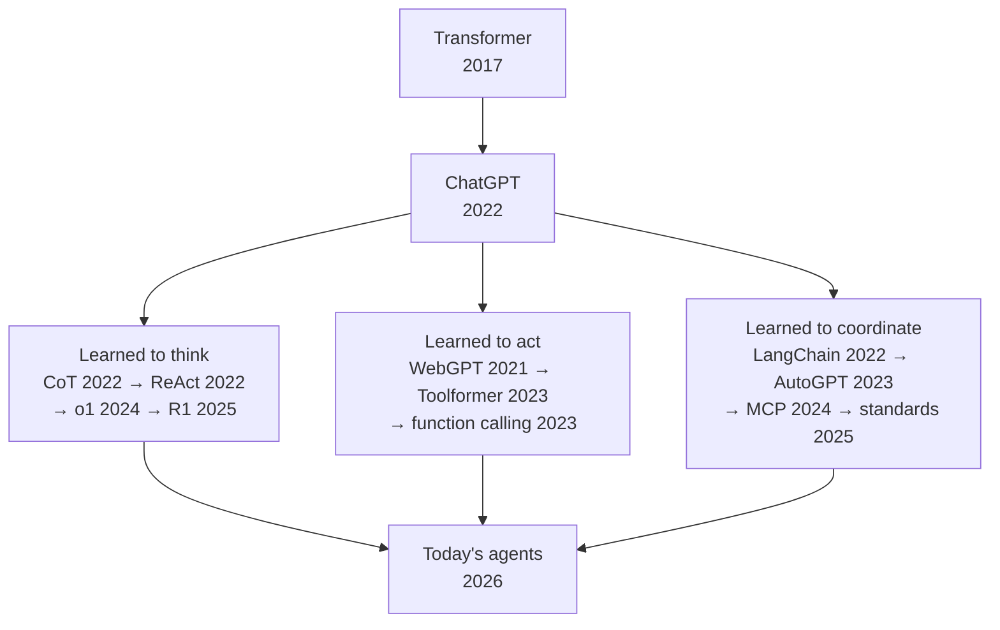
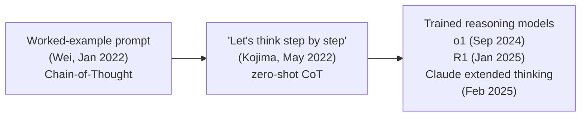
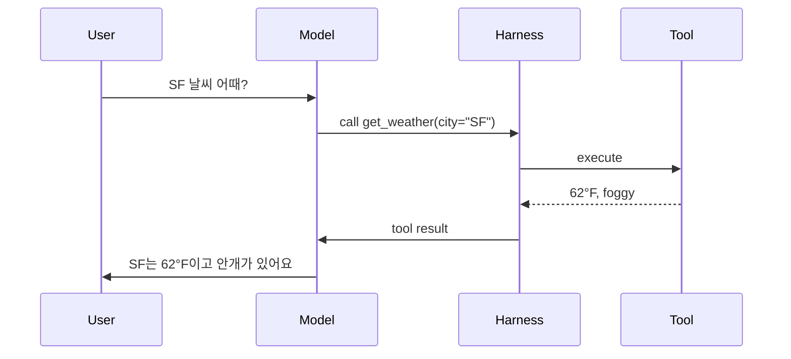
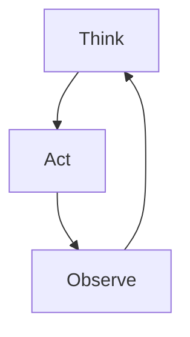
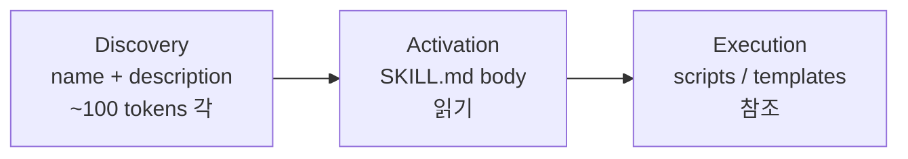
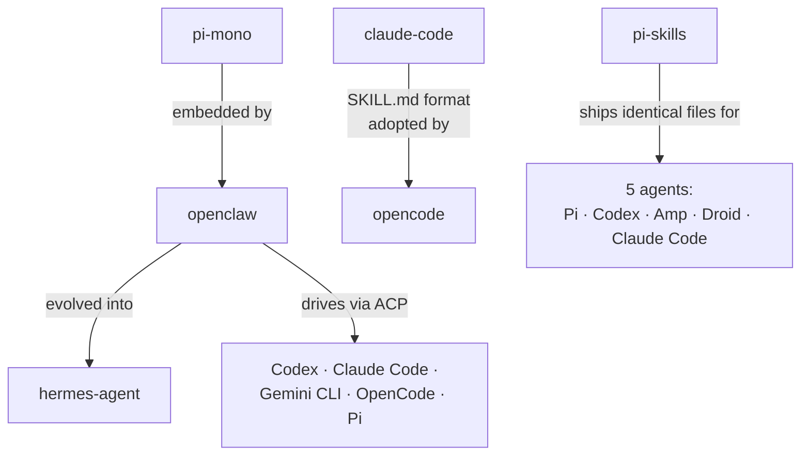
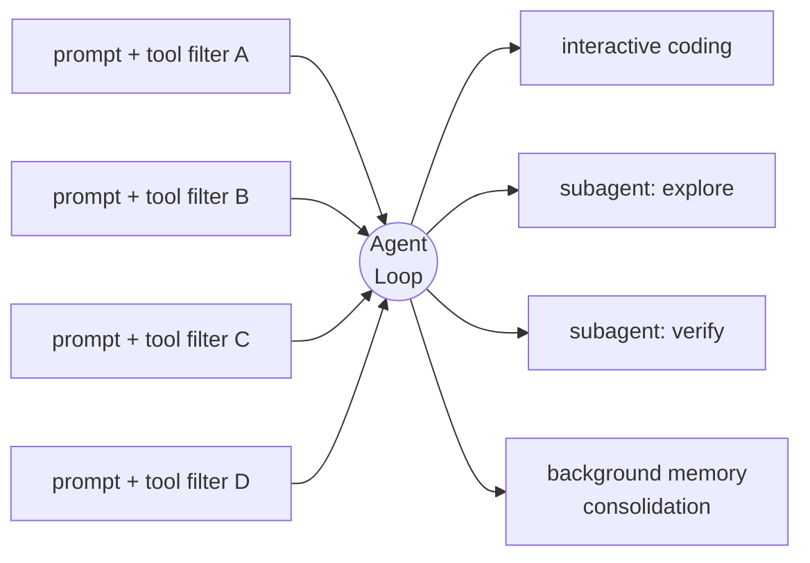

<!-- _class: lead -->

# Modern AI Agents

#### 어떻게 여기까지 왔고, 무엇이며, 무엇을 두고 다투는가

<br>

발표자 · 2026-05

<!--
[발표 시 언급할 포인트]
- 간단한 자기소개 한 문장 — 이 talk 자체가 credential이다.
- 전체 시간 ~35–40분, Q&A는 마지막에.
- 한 줄 약속: 이 talk이 끝나면, 오늘날 AI agents가 왜 다르고 어떻게 고를지 이해할 수 있다.
- 사전 AI 배경 지식 불필요 — 용어는 진행하면서 정의한다.

[전달 메모]
- 천천히 시작. 페이스는 후반부로 갈수록 올라간다.
-->

---

<!-- _class: lead -->

## 30초 요약: 세 갈래, 하나의 수렴



<!--
[발표 시 언급할 포인트]
- AI agents는 하나의 발명에서 나오지 않았다. 세 갈래가 병렬로 자라났다.
- 공통 기반은 Transformer architecture (2017)와 chat-model interface (ChatGPT, 2022).
- 그 위에서 세 갈래가 거의 동시에 발전:
  - 모델이 "생각"을 배웠다 — reasoning이 별도 channel이 되었다
  - 모델이 "행동"을 배웠다 — tool use가 protocol이 되었다
  - 분야가 그것들을 "조율"하는 법을 배웠다 — orchestration frameworks, 그리고 cross-vendor standards
- 세 갈래 모두 오늘날의 agents로 수렴.
- 이 도식이 talk 전체의 roadmap이다. 각 branch가 한 section.

[전달 메모]
- linear timeline이 아니라 diamond shape인 이유를 짧게 짚기:
  CoT (Jan 2022)는 사실 ChatGPT (Nov 2022)보다 먼저였고,
  WebGPT (Dec 2021)도 그렇다. 세 갈래는 sequential이 아니라 parallel.
-->

---

<!-- _class: lead -->

## 핵심 주장

<br>

> ### 2026년의 AI agents는<br>**서로 합의한 것이 더 많고,**<br>**남은 차이는 editorial이다.**

<!--
[발표 시 언급할 포인트]
- punchline을 미리 던진다 — 청중이 어디로 가는지 알면 인지 부담이 줄어든다.
- "editorial"이 무슨 뜻인지 한 문장으로 설명: 각 project가 "무엇을 거부하는가, 무엇을 표준화하는가, trust boundary를 어디에 긋는가, agent가 스스로를 수정해도 되는가"에 대한 선택.
- Architecture는 안정화되었고, 남은 disagreement는 capability가 아니라 *취향*이다.
- 이 slide 이후의 전체 talk이 이 주장을 *증명*한다.

[전달 메모]
- 지금 이 주장을 *defend*하지 마라. talk 전체가 defense.
-->

---

# Model이 instructions를 따르는 법을 배웠다

<div class="cols-2">
<div class="card">

**Before 2020**

<br>

<div class="mono">"오늘 날씨는..."</div>

<br>

**→** 다음 단어를 예측하는<br>정교한 autocomplete

</div>
<div class="card blue">

**After 2022**

<br>

<div class="role-box">
<span class="role">user:</span> 메일 정리해줘
</div>
<div class="role-box">
<span class="role">assistant:</span> 어떤 기준으로?
</div>

<br>

**→** 지시를 따르는 *partner*

</div>
</div>

<div class="callout">
2020-2022 — scale + instruction tuning + RLHF
</div>

<!--
[발표 시 언급할 포인트]
- 2020년 이전: language model은 정교한 autocomplete였다 — 다음 단어를 예측.
- GPT-3 (2020)가 흥미로운 사실을 보여줬다: scale이 충분하면, 같은 machinery가 자연어로 쓰인 instruction을 따르는 법을 학습한다.
- 세 가지 ingredient가 "completion engine"을 "follower of directives"로 바꿨다:
  - **scale** — 더 많은 parameter와 data
  - **instruction tuning** — "지시를 따르라"는 example로 fine-tune
  - **RLHF** — 사람이 어떤 답변을 선호하는지로 학습
- breakthrough는 architecture가 아니라 *interface*였다. model의 모양은 그대로, 우리가 model과 대화하는 방식이 바뀌었다.
- ChatGPT (2022.11.30)가 이게 모두에게 보이게 된 순간.

[전달 메모]
- Transformer 내부나 scaling laws를 깊이 다루지 마라.
- 이 슬라이드는 단 하나의 shift만 보여주면 된다: completion → instruction.
-->

---

# Chat model — 세 가지 role

<br>

<div class="role-box">
<span class="role">system:</span> 모델에게 주는 규칙 (보이지 않음)
</div>

<div class="role-box">
<span class="role">user:</span> 사용자가 입력하는 것
</div>

<div class="role-box">
<span class="role">assistant:</span> 모델이 답하는 것
</div>

<br>

<div class="callout">
모든 chat model의 universal API — Claude, ChatGPT, Gemini, Llama 모두 동일
</div>

<!--
[발표 시 언급할 포인트]
- 모든 chat-tuned model은 같은 세 가지 message role을 쓴다. 이것이 universal API다.
- **system** = 너에게 보이지 않는 instruction (규칙, persona, "너는 helpful한 assistant다")
- **user** = 사람이 입력하는 것
- **assistant** = model이 답하는 것
- 이 format은 OpenAI의 ChatGPT API (2023.03)에서 시작해서 Anthropic, Google, Meta, Mistral, 그리고 모든 open-weight chat template이 채택했다. cross-vendor lingua franca.
- 이 talk의 나머지 모든 것 — tool use, reasoning, agents — 이 세 role의 frame 안에서 일어난다. 모든 것이 통과하는 keyhole.

[전달 메모]
- 이 slide가 vocabulary checkpoint다.
- 이 다음부터는 "system prompt"나 "tool message"를 설명 없이 써도 된다.
-->

---

# Model이 "생각"을 배웠다



<div class="callout">
이제 model은 두 channel을 따로 출력한다 — final answer + thinking trace
</div>

<!--
[발표 시 언급할 포인트]
- "Reasoning"은 마법처럼 들리지만 이야기는 평범하고 짧다 — 두 단계.
- **Stage 1 — prompt trick.** Wei et al. (2022.01)이 보여줬다: prompt에 reasoning example을 넣으면, model이 그 style을 imitate해서 math와 logic을 더 잘 푼다. Kojima et al. (2022.05)은 더 단순하게: "Let's think step by step"만 붙여도 zero-shot으로 작동.
- **Stage 2 — trained capability.** 2024.09, OpenAI가 o1 출시 — reinforcement learning으로 긴 internal reasoning을 *학습*한 model. 2025.01, DeepSeek-R1 (open weights)이 o1 수준 달성. 2025.02, Claude가 extended thinking mode 추가.
- 왜 중요한가: reasoning이 **별도 output channel**이 되었다. 현대 model은 private thinking trace + final answer를 따로 출력한다. 두 가지로 분리된 cost, 두 가지 audience (개발자는 trace를 읽고, 사용자는 answer를 본다).
- 메커니즘은 단순: 더 많은 token = 문제당 더 많은 compute. 중간에 "thinking"을 만드는 것이 forward pass에 공간을 주고, context window를 working memory로 활용한다.

[전달 메모]
- 핵심은 *탈신비화*. Reasoning은 새로운 종류의 지능이 아니라, 같은 model이 어려운 문제에 더 많은 compute를 쓰는 것이다.
-->

---

# Model이 "행동"을 배웠다 — tools



<div class="callout">
Function calling — OpenAI, 2023년 6월 13일
</div>

<!--
[발표 시 언급할 포인트]
- 순서를 따라가자: user가 질문하면, model이 *structured* tool call을 emit한다 (free text가 아니라 JSON 형태의 request). harness가 실행하고, 결과가 돌아오고, model이 final answer를 만든다.
- 결정적 날짜: **2023년 6월 13일** — OpenAI가 *function calling*을 ship.
- 그 전에는 prompt에 "JSON 형식으로 출력해줘"라고 쓰고 기도해야 했다. 그 후에는 model이 tool call을 별도 API field로 *학습된 채로* emit한다.
- Anthropic이 따라왔고 (2023.11 beta → 2024.05 GA), Google도 2024년에 따라왔다. 2024년 말, function calling은 table stakes.
- Tools가 작동하면 model은 무엇이든 쓸 수 있다: shell, browser, file editor, database, API.
- 이 단순한 cycle — model이 call → harness 실행 → result 반환 — 이 모든 modern agent의 building block.

[전달 메모]
- 아직 "agent loop"라고 부르지 마라 — 다음 슬라이드에서.
- 이 슬라이드는 한 번의 trip; 다음 슬라이드가 cyclical로 만든다.
-->

---

# Agent loop — think · act · observe



<div class="callout">
ReAct — Reasoning + Acting interleaved (Yao 2022)<br>
한 바퀴 = 한 번의 model call
</div>

<!--
[발표 시 언급할 포인트]
- 이제 slide 6 (think)과 slide 7 (act)을 합친다. model이 생각하고, 행동하고, 결과를 관찰하고, 다시 생각한다. task가 끝날 때까지 반복.
- 이 loop의 이름이 있다: **ReAct** — Reasoning + Acting의 줄임말. 2022년 Princeton/Google paper (Yao et al.)에서 나왔다.
- 한 바퀴 = 한 번의 model call. harness가 loop를 돌리고, model이 멈출 시점을 결정한다.
- 이것이 **모든 modern AI agent의 spine**이다 — Claude Code, Cursor, ChatGPT with tools, AutoGPT, 모든 framework. surface는 달라도 loop은 같다.
- 여기서부터 모든 slide은 이 loop을 *구현*하거나 (9-14), *특성화*하거나 (17-19), *configure*한다 (20-22).

[전달 메모]
- 청중에게 이 도식을 가리키며 말하라: "스크린샷 찍어두세요. 이 모양이 이후 모든 슬라이드에 나옵니다."
-->

---

# 2023 — agents가 viral해졌다

<div class="cols-2">
<div>

**Timeline**

- **2022.10** — LangChain
- **2022.11** — ChatGPT
- **2023.03.30** — AutoGPT *(13일 만에 30K stars; 4월 말 100K)*
- **2023.04.03** — BabyAGI
- **2023.08** — AutoGen, MetaGPT
- **2024.01** — CrewAI
- **2024.11.25** — MCP

</div>
<div class="card">

연구 paper에서 product category까지<br>**~5-6개월**

<br>

AutoGPT는 "AI agent"가<br>비전문가에게도 익숙해진 순간

<br>

그러나 대부분의 demo는 cherry-picked.<br>2023년 가을이 되자 "trough of disillusionment"

</div>
</div>

<!--
[발표 시 언급할 포인트]
- Agent loop이 연구 diagram에서 product category가 되기까지 약 5-6개월 — ReAct paper (2022.10) → AutoGPT (2023.03).
- **LangChain** (Harrison Chase, 2022.10.24)이 첫 번째 widely-used orchestration framework. ChatGPT보다 한 달 먼저 나왔지만, ChatGPT가 나온 후 폭발적으로 성장.
- **AutoGPT** (Toran Bruce Richards, 2023.03.30)가 결정적 순간: 목표, memory, browsing, file editing이 있는 "autonomous" agent. 13일 만에 GitHub 30K stars, 4월 말 100K — 당시 가장 빠르게 성장한 open-source project.
- 이때 "AI agent"가 CEO도 아는 noun이 됐다.
- 그 다음 **BabyAGI** (2023.04.03), **AutoGen** (Microsoft, 2023.08), **MetaGPT** (2023.08), **CrewAI** (2024.01) — multi-agent framework들이 위에 layer로 올라갔다.
- 솔직히: 대부분의 AutoGPT demo는 cherry-picked. 실제 run은 loop에 갇히고, hallucinate하고, 진짜 돈을 썼다. 2023년 가을, 논조가 "trough of disillusionment"로 뒤집혔다.

[전달 메모]
- AutoGPT의 기여는 *technical*이 아니라 *cultural* — agent의 *모양*을 전 세계에 보여줬다.
- 신뢰성 문제는 2년 더 걸렸다 (더 나은 model, 더 나은 tool API, MCP).
-->

---

# Wave가 가르쳐준 것

<div class="cols-2">
<div class="card">

**Lessons learned**

- Own your prompts
- Own your context
- Own your control flow

<br>

— *12-Factor Agents* 학파

</div>
<div class="card blue">

**MCP as punctuation**

<br>

Framework wars는 결국<br>**orchestration**이 아니라<br>**integration**을 표준화하면서 끝났다

<br>

— *Nov 2024*

</div>
</div>

<!--
[발표 시 언급할 포인트]
- Orchestration framework (LangChain, AutoGen, CrewAI, MetaGPT)들은 2023년에 시끄러웠지만, 2024년이 되자 dominant feedback은: *framework들이 over-abstracted였고, orchestration layer는 문제의 가장 작은 부분이다*.
- Production wisdom — "12-Factor Agents" 학파:
  - **Own your prompts** — framework abstraction 뒤에 숨기지 마라
  - **Own your context** — 매 turn 무엇이 window에 들어갈지 *네가* 결정해라
  - **Own your control flow** — loop는 직접 써라; loop는 작다
- Framework wars는 모두가 *orchestration* layer가 작고 *integration* layer가 크다는 데 동의하면서 끝났다. MCP (Nov 2024)가 표준화한 것은 후자 — agent와 tool이 어떻게 연결되는가, agent를 어떻게 만드는가가 아니라.
- Framework era에서 남은 것은 **mental model**이다 (agent = loop + tools + memory + objective). Framework 자체는 후퇴.

[전달 메모]
- 청중에게 이 순간 말해라: "agents를 이해하기 위해 LangChain을 배울 필요는 없습니다." pattern은 library를 초월한다.
-->

---

# Model을 조종하는 두 축

<div class="cols-2">
<div class="card red">

### Constrain
원치 않는 행동을 *막는다*

<br>

- refuse / content filters
- sandbox
- permission prompts

</div>
<div class="card blue">

### Steer
목적에 *맞게 유도한다*

<br>

- system prompts (role pinning)
- structured output
- tool-registry trimming
- verdict contracts

</div>
</div>

<div class="callout">
"규칙을 따르라고 model에게 부탁하지 말고, 위반할 능력을 제거하라"
</div>

<!--
[발표 시 언급할 포인트]
- 강력한 generalist model을 어떻게 task에 집중시키고 — trouble에서 멀어지게 하나? 두 가지 보완적 축.
- **Constrain** (negative axis) — 원치 않는 행동을 막는다. Refusal training, output filter, sandbox, 위험한 action 전의 permission prompt.
- **Steer** (positive axis) — 정의된 purpose에 맞게 channel한다. System prompt (agent의 job description), structured output (JSON schema 강제), tool denylist (위험한 tool을 *제거*), verdict contract ("PASS or FAIL로 끝내라").
- 지난 1년 가장 흥미로운 design move: **구조적으로 enforce하라, 정중하게 부탁하지 말고**. Claude Code의 read-only reviewer subagent에는 `Edit` tool이 *없다*. Rule이 prompt의 한 문장이 아니라 *없는 capability*. Model이 literally 위반할 수 없다.
- 두 축이 함께: sandbox는 *외부 세계*를 model로부터 보호하고, structural denylist는 *task*를 model이 off-script되는 것으로부터 보호한다.

[전달 메모]
- 이것이 deck에서 가장 중요한 *editorial* 아이디어.
- 청중이 새로운 mental model 하나만 가지고 나간다면, 이것이 그것이다 — purpose는 prompt가 말하는 것이 아니라 model이 가진 tool이 enforce한다.
-->

---

# 2024-2025: standards가 도착했다

<div class="cols-4">
<div class="card blue">

**MCP**
*tool bridge*

<br>

Anthropic<br>
2024.11.25

</div>
<div class="card blue">

**AGENTS.md**
*project context*

<br>

OpenAI Codex CLI<br>
mid-2025

</div>
<div class="card blue">

**ACP**
*editor bridge*

<br>

Zed<br>
2025.08.27

</div>
<div class="card blue">

**SKILL.md**
*capability artifact*

<br>

Anthropic<br>
2025.10.16

</div>
</div>

<br>

<div class="callout">
12개월 안에 4개의 cross-vendor standards
</div>

<!--
[발표 시 언급할 포인트]
- 12개월 안에 4개의 cross-vendor standard — 어떤 software 분야에서도 드물고, AI에서는 전례가 거의 없다.
- **MCP** (Model Context Protocol, Anthropic, 2024.11.25): agent가 *tool과 data source*와 대화하는 protocol. Day-1부터 open-source. OpenAI가 2025.04 채택; Linux Foundation에 2025.12 donate.
- **AGENTS.md** (mid-2025, OpenAI Codex CLI): project가 agent에게 자기 자신에 대해 알려주는 plain Markdown 파일. Git처럼 project root에서 cwd로 walk한다. 2025년 말 Linux Foundation에 donate; 2026년 초 기준 ~60K open-source project가 사용.
- **ACP** (Agent Client Protocol, Zed, 2025.08.27): *editor*가 *agent*와 대화하는 방법. Language server에 대한 LSP와 같은 역할 — 모든 editor를 모든 agent에 연결.
- **SKILL.md** (Anthropic Claude Skills, 2025.10.16; `agentskills.io` 표준 2025.12.18): 휴대 가능한 capability bundle. Markdown + YAML frontmatter + optional script.
- 각각이 minimal — text-shaped 혹은 JSON-RPC-shaped — 그 단순함이 adoption을 마찰 없게 만들었다.

[전달 메모]
- adoption의 *규모*를 강조하라. 4개 standard, 모든 major vendor (Anthropic, OpenAI, Google, Microsoft, Meta, 수십 개의 CLI와 editor), 1년.
- 우연이 아니다 — field가 *준비되어* 있었다.
-->

---

# 세 protocol, 세 layer

<br>

<div style="font-family: 'JetBrains Mono', monospace; font-size: 0.95em; line-height: 1.8;">

<div class="card">

📝 **Editor** *(Zed, VS Code, …)*

⬇️  ACP

🤖 **Agent** *(Claude Code, opencode, …)*

⬇️  MCP

🔧 **Tools / Resources** *(server들)*

</div>

</div>

<br>

<div class="callout">
LSP가 language server를 했다면, ACP는 agent를, MCP는 tool을 한다
</div>

<!--
[발표 시 언급할 포인트]
- 세 protocol, 세 layer, 세 job. 각각 minimal, composable.
- **Editor ↔ Agent: ACP.** Zed를 열고 AI sidebar가 Claude Code와 통신할 때, 그것이 ACP.
- **Agent ↔ Tools: MCP.** Agent가 GitHub를 검색하거나 database를 query할 때, 그것이 MCP.
- 2026년의 전형적인 setup: Zed (editor)가 Claude Code (agent)에 ACP로 말하고, Claude Code가 GitHub server, Postgres server, Slack server에 MCP로 말한다.
- 어느 한 layer의 vendor는 다른 layer를 건드리지 않고 swap 가능. Language server에 대한 LSP와 같은 모양 — composable plumbing.

[전달 메모]
- 청중이 LSP를 알면 (VS Code/Vim 등의 code intelligence를 가능하게 하는 IDE↔language-server protocol), analogy를 바로 써라: "ACP는 agent에 대해 LSP가 language server에 대한 것이다."
- 모르면 두 surface를 그냥 묘사하라: "editor가 agent와 대화 protocol 하나, agent가 tool과 대화 protocol 하나."
-->

---

# Skills — 휴대 가능한 artifact



<div class="cols-2">
<div>

**Progressive disclosure**

30 skills × ~100 tokens<br>≈ **3K tokens** startup

vs

30 skills × ~2,000 tokens<br>≈ **60K tokens** eager load

</div>
<div class="callout">
같은 SKILL.md 파일이<br>Claude Code / Codex / Cursor /<br>OpenCode / Pi / Goose에서 동작한다
</div>
</div>

<!--
[발표 시 언급할 포인트]
- Skill은 폴더다. 안에 `SKILL.md` (Markdown + 두 줄 YAML header: name + description + free-form instruction)가 있다. 옆에 `scripts/` 디렉터리가 있을 수도 있다.
- 핵심 혁신은 **progressive disclosure** — 세 단계:
  - **Discovery**: startup 시, agent는 각 skill의 name과 description만 본다 (~100 token 각).
  - **Activation**: model이 skill이 필요하다고 판단하면, full body를 읽는다.
  - **Execution**: body가 script나 template를 reference하면, 그때만 연다.
- 계산: 30 skills × 100 tokens at startup ≈ 3K. 같은 30개를 eager load하면 ~60K tokens — 사용자가 입력하기 전에 이미. Progressive disclosure가 수십 개 skill을 ship하는 것을 가능하게 한다.
- 같은 SKILL.md 파일이 Claude Code, Codex CLI, Cursor, OpenCode, Pi, Goose, 그리고 ~25개의 다른 tool에서 동작한다. 그냥 Markdown이니까.
- 이것이 분야에서 가장 깊은 interop story — 휴대 가능한 *capability* artifact (model만이 아니라).

[전달 메모]
- 강조: 휴대성을 만든 것은 minimalism이다. Markdown은 상상할 수 있는 가장 평범한 format — 그래서 퍼졌다.
-->

---

# 5개의 agent, 5개의 editorial 선택

<div class="cols-5">

<div class="card">

**claude-code**

Anthropic

🖥️ terminal

<br>

*the layered platform*

</div>

<div class="card">

**opencode**

SST

🖥️🌐 terminal + web

<br>

*typed protocol surface*

</div>

<div class="card">

**pi-mono**

badlogic

🖥️ terminal

<br>

*refuse-and-eject<br>minimalism*

</div>

<div class="card">

**hermes-agent**

Nous Research

💬 multi-channel

<br>

*self-improving<br>training env*

</div>

<div class="card">

**openclaw**

community

💬 multi-channel

<br>

*single-operator<br>gateway*

</div>

</div>

<!--
[발표 시 언급할 포인트]
- 이 다섯이 talk의 나머지가 기반으로 하는 agent. 계속 돌아온다.
- **claude-code** (Anthropic): reference implementation. 모든 것이 markdown + frontmatter. MCP-first. ~40 built-in tool, layered permission, 모든 곳의 hook.
- **opencode** (SST): server-first. Agent가 typed HTTP API 뒤에 살고, terminal UI는 *하나의* client일 뿐. `models.dev`에서 model catalog를 live로 가져옴.
- **pi-mono** (Mario Zechner): 7개의 tool. *No* MCP, *no* subagent, *no* permission popup. 다른 모든 것은 extension. 원칙적으로 거부.
- **hermes-agent** (Nous Research): self-improving. Agent가 자기 memory를 편집하고 자기 skill을 만든다. 동시에 다음 model을 위한 training environment.
- **openclaw** (community): 한 명의 operator, 세 단계 Docker sandbox, multi-channel daemon. *pi-mono*를 agent runtime으로 embed.
- 청중이 5개를 외울 필요는 없다. 핵심은 *각각 다른 editorial 선택을 한다는 것* — 그리고 그 선택이 다음 slide.

[전달 메모]
- canonical name으로가 아니라 *example*로 land시켜라.
- 이 project들이 representative하는 *선택*이 project 자체보다 중요하다.
-->

---

# 어떻게 연결되어 있는가



<div class="callout">
Standards는 진짜다. Ecosystem이 compose된다.
</div>

<!--
[발표 시 언급할 포인트]
- Ecosystem은 5개의 isolated project가 아니다. 서로 code를 공유하고, format을 공유하고, 의존한다.
- **openclaw**는 agent loop을 reinvent하지 않는다 — pi-mono를 library로 import하고 그 위에 session lane, sandbox, multi-channel routing을 더한다.
- **hermes-agent**는 `hermes claw migrate`라는 command를 ship한다 — 너의 `~/.openclaw` directory를 import. hermes는 openclaw에서 자라났다.
- **opencode**는 `~/.claude/skills/`를 직접 읽는다. Provider-agnosticism이 *artifact*까지 확장 (model만이 아니라).
- **pi-skills** (community skill collection)는 5개의 다른 agent용 install instruction과 함께 *identical* SKILL.md 파일을 ship한다: Pi, Codex, Amp, Droid, Claude Code.
- **openclaw**는 ACP를 양방향으로 쓴다: IDE를 위한 ACP server이면서, `acpx` extension으로 Codex / Claude Code / Gemini CLI / OpenCode / Pi를 nested child로 *drive*한다.
- 각 cross-reference가 **standards가 진짜이고 ecosystem이 compose된다**는 증거. "competition table"이 아니라 "family tree".

[전달 메모]
- 이 slide가 다음에 나오는 universals slide의 근거가 된다.
- 표준이 있다고 말하고 *실제 interop*을 보여주면, abstraction이 credible해진다.
-->

---

# One loop, many policies



<div class="callout">
Multi-agent는 *별도 platform*이 아니다 — 같은 loop을 다르게 configure한 것이다
</div>

<!--
[발표 시 언급할 포인트]
- 이것이 분야에서 **가장 universal한 pattern** — 우리가 본 다섯 agent 모두에 걸쳐.
- 같은 `while (true) { call model; run tools }` loop. 위에 다른 policy: 다른 prompt, 다른 tool filter, 다른 permission context.
- claude-code의 source에서 *하나의 파일* (`query.ts`)이 처리한다: interactive REPL, headless SDK call, 모든 종류의 subagent, remote session, background memory consolidation. 모두 같은 loop의 configuration.
- 구체적 예: "verify" subagent는 같은 loop인데 mutating tool을 제거한 denylist + "구현을 깨뜨려라"는 prompt + "VERDICT: PASS or FAIL로 끝내라"는 contract. "explore" subagent는 같은 loop인데 read-only tool.
- Slogan: **multi-agent behavior는 별도 platform이 아니라 같은 loop을 reconfigure한 것이다.**

[전달 메모]
- 이 말을 천천히 크게 해라: "Subagent는 별도 engine이 아닙니다."
- 누군가의 다음 agent design을 바꿀 만한 insight.
-->

---

# 다섯 agent가 합의하는 것 — universals

<div class="cols-2">
<div>

✅ One loop, many policies

✅ Methodology in prompts, not state

✅ Compaction as control flow

</div>
<div>

✅ Streaming + parallel tool execution

✅ SKILL.md + AGENTS.md as<br>cross-vendor artifacts

✅ ACP for editors, MCP for tools

</div>
</div>

<div class="callout">
*Universals = 이제 더 이상 흥미롭지 않은 부분*
</div>

<!--
[발표 시 언급할 포인트]
- 이 여섯 pattern이 다섯 agent *모두*에 나타난다. 더 이상 흥미롭지 않다 — 즉, designer들이 더 이상 differ하지 않는 곳.
- **One loop, many policies** — slide 17의 finding.
- **Methodology in prompts, not state** — code에 rigid한 "phase 1 / phase 2" state machine이 없다. Model이 active sequencer이고, runtime은 그 선택을 safe하게 만든다.
- **Compaction as control flow** — context window 관리가 특별한 feature가 아니라 매 turn의 일부. (예: claude-code는 매 model call 전에 다섯 단계의 compaction을 돌린다.)
- **Streaming + parallel tool execution** — tool이 model token output과 동시에 돌고, 한 turn에 여러 tool이 dispatch.
- **SKILL.md와 AGENTS.md** — capability와 project context를 위한 cross-vendor 파일 convention.
- **ACP for editors, MCP for tools** — 두 cross-vendor protocol.
- "uninteresting" framing은 positive: stable foundation이 있어야 designer들이 흥미로운 차이 (다음 slide)에 집중할 수 있다.

[전달 메모]
- 이 list는 가독성을 위해 curate한 것.
- 더 있는 universal (recovery as control flow, prefix-cache discipline, pattern-rule permissions 등) — 물어보면 언급.
-->

---

# 다섯 agent가 *불일치하는 곳* — rifts

<br>

<table>
<tr>
<th>축</th><th>한쪽 극</th><th>다른 쪽 극</th>
</tr>
<tr><td>Process model</td><td>server-first</td><td>binary-first</td></tr>
<tr><td>MCP</td><td>load-bearing</td><td>deliberately refused</td></tr>
<tr><td>Sandbox</td><td>in core</td><td>your problem</td></tr>
<tr><td>Memory</td><td>layered + curator</td><td>none in core</td></tr>
<tr><td>Subagents</td><td>first-class</td><td>refused</td></tr>
<tr><td>Trust frame</td><td>multi-tenant</td><td>one-operator</td></tr>
</table>

<div class="callout">
모두 architectural이 아니라 *editorial*. 한쪽을 택하면 나머지 결정이 따라온다.
</div>

<!--
[발표 시 언급할 포인트]
- 다섯 agent가 structurally disagree하는 여섯 곳.
- **Server-first vs binary-first.** Agent가 daemon (opencode, hermes, openclaw)이냐 single binary (claude-code, pi-mono)냐. Multi-surface (mobile, IDE, chat)이 거의 free인지를 결정.
- **MCP load-bearing vs refused.** 다섯 중 셋은 MCP를 core에 build, 둘은 명시적으로 거부 (pi-mono, openclaw). 거부는 ignorance가 아니라 *position*.
- **Sandbox in core vs your problem.** Openclaw는 세 단계의 Docker sandbox를 ship; pi-mono는 명시적으로 user에게 맡긴다.
- **Memory layered + curator vs none.** Hermes-agent는 stale skill을 auto-archive하는 curator가 있는 4-layer memory architecture. Pi-mono는 learned memory가 전혀 없다. Claude-code는 그 중간.
- **Subagents first-class vs refused.** Claude-code는 ~6개의 built-in subagent type을 ship; pi-mono는 subagent를 완전히 거부.
- **Multi-tenant vs one-operator.** Openclaw는 *한 user, 한 host*를 위해 명시적으로 설계. 나머지는 implicitly multi-tenant.
- 이 선택들은 right-or-wrong이 아니다 — *editorial*. 각 agent가 한쪽을 택하고, 그 선택이 나머지 결정 대부분을 예측.

[전달 메모]
- 위계를 암시하지 않도록 주의. "Refusal"이 negative하게 들리지만, pi-mono가 MCP를 거부하는 것은 design goal에 deliberate하고 defensible한 선택. openclaw가 agent hierarchy를 거부하는 것도 같다.
-->

---

# 2026년의 AI agent — canonical shape

<br>

```
┌───────────────────────────────────────────────────┐
│  Surface  (TUI · chat · IDE · …)                  │
├───────────────────────────────────────────────────┤
│  Session  (history · compaction · retry)          │
├───────────────────────────────────────────────────┤
│  Loop     (prompt → model → tools → result)       │
├───────────────────────────────────────────────────┤
│  Provider · Tools · Permissions                    │
├───────────────────────────────────────────────────┤
│  Extensions  (MCP · Skills · Plugins · Hooks)     │
└───────────────────────────────────────────────────┘
```

<div class="callout">
Streaming chat loop + tools + permissions + extensions —<br>
prompt + tool filter + permission policy를 바꿔서 여러 runtime으로 configure
</div>

<!--
[발표 시 언급할 포인트]
- 모든 modern AI agent의 한 도식, 한 번 그렸다.
- **Surface** — 사람이 보는 것 (terminal, IDE, chat app, mobile, web).
- **Session** — durable한 conversation state, history와 compaction 포함.
- **Loop** — slide 8의 recurring spine.
- **Provider / Tools / Permissions** — model API, tool registry, agent가 무엇을 할 수 있는지의 규칙.
- **Extensions** — MCP server, skill, plugin, agent-specific config.
- 우리가 본 다섯 agent 모두 이 모양에 fit한다. 다른 것은 *각 layer가 어떻게 build됐는가*이지, *layer가 있는지 여부*가 아니다.
- 한 줄 정의: *"Streaming chat loop over a provider abstraction, with tools, permissions, and extensions — configurable into many runtimes by changing prompt + tool filter + permission policy."*

[전달 메모]
- slide 8의 loop을 다시 가리켜라 — 같은 loop인데 이제 더 큰 stack에 embed.
-->

---

# 어떤 문제 class에 있는가?


<!--
[발표 시 언급할 포인트]
- "Best" agent는 없다. 다섯 problem class를 위한 다섯 pattern이 있다.
- **혼자서 코딩, hand-buildable** → pi-mono pattern. 7개 tool, no MCP, refuse-and-eject. Simple, opinionated, fast.
- **Coding agent를 platform으로** → claude-code pattern. Layered platform, MCP-first, 모든 것이 markdown + frontmatter. Ecosystem용.
- **Everywhere에서 도는 coding agent** → opencode pattern. Server-first, typed HTTP API, 여러 client (terminal, web, mobile, IDE).
- **Chat platform에서의 personal assistant** → openclaw pattern. Single-operator gateway, multi-channel daemon, Docker-tiered sandbox.
- **Self-improving + training environment** → hermes-agent pattern. Skill을 auto-archive하는 curator, trajectory generation을 위한 batch-runner, agent가 자기 자신의 training distribution.
- 옳은 질문은 "어떤 agent가 best인가"가 아니다. **"내가 어떤 problem class에 있는가"** — 그 답이 pattern을 고른다.

[전달 메모]
- 여기서 deck이 thesis를 cash한다.
- slide 19의 rift들이 *problem class와 correlate*한다 — 그래서 disagreement가 editorial이지 architectural이 아닌 것.
-->

---

# 2026에 agent를 만들려면 — table stakes

<div class="cols-2">
<div>

1. Streaming chat loop
2. Tool registry + schema 검증
3. SKILL.md loader
4. AGENTS.md walk
5. Compaction stage

</div>
<div>

6. Permissions OR sandbox
7. MCP (또는 명시적 refusal)
8. ACP server
9. Durable session store
10. Subagent affordance

</div>
</div>

<br>

<div class="callout">
이 중 어느 것도 reinvent할 필요 없다 — 모두 우리가 본 다섯 project 중 *어딘가*에 있다.<br>
흥미로운 일은 <strong>너의 문제 class에 어떤 pattern이 중요한지 고르고, 나머지는 거부하는 것이다.</strong>
</div>

<!--
[발표 시 언급할 포인트]
- 2026에 처음부터 agent를 만든다면, 이것이 floor.
- 각 item은 **현재의 expectation**이지 aspirational feature가 아니다.
- 10개를 짧게:
  (1) streaming model+tool loop
  (2) schema validation이 있는 tool registry
  (3) SKILL.md loader
  (4) cwd에서 root로 AGENTS.md walk
  (5) compaction stage
  (6) permissions OR sandbox
  (7) MCP support 혹은 명시적 refusal
  (8) ACP server
  (9) durable session store
  (10) subagent affordance
- 어느 것도 invent할 필요 없다. 우리가 본 다섯 project *최소 하나*에 있다 — 대부분은 *모두*에 있다.
- 2026의 흥미로운 일은 이것들을 reinvent하는 것이 아니라, **너의 problem class에 어떤 pattern이 중요한지 고르는 것** — 그리고 나머지는 거부하는 것.

[전달 메모]
- 여기서 짧게 멈춰라. 이 slide가 talk의 practical takeaway — 만들러 가는 사람이 있다면, 이 checklist.
-->

---

<!-- _class: lead -->

# Closing

<br>

> Agents agree more than they disagree.

> The rifts that remain are *editorial* —<br>what to refuse, what to formalize,<br>how to draw trust boundaries.

> ### Pick yours.

<br>

<div class="small muted">
docs corpus: per-agent docs · comparison · research · references
</div>

<!--
[발표 시 언급할 포인트]
- 마지막으로 thesis를 다시: agents agree more than they disagree.
- Architecture는 settled. 남은 rift들 — 무엇을 거부하고, 무엇을 formalize하고, trust boundary를 어디에 긋고, agent가 자기 자신을 편집해도 되는지 — 모두 capability가 아니라 취향의 문제.
- editorial 선택을 잘못 했을 때의 cost는 2022년보다 2026년이 훨씬 작다 — 밑의 substrate가 훨씬 안정되어 있기 때문.
- docs corpus에 대해 짧게 언급 (per-agent doc, comparison, research, reference). 어디서 찾을 수 있는지.
- 감사 인사. 질문 받기.

[전달 메모]
- 여기서 새 material을 도입하지 마라.
- 이 slide의 일은 thesis를 청중이 들고 나갈 한 호흡으로 압축하는 것.
-->
