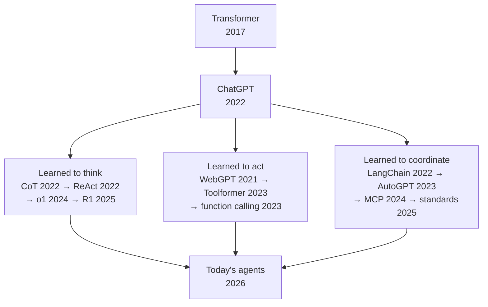
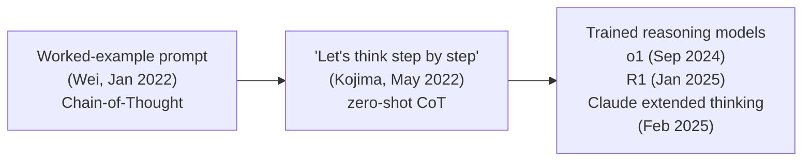
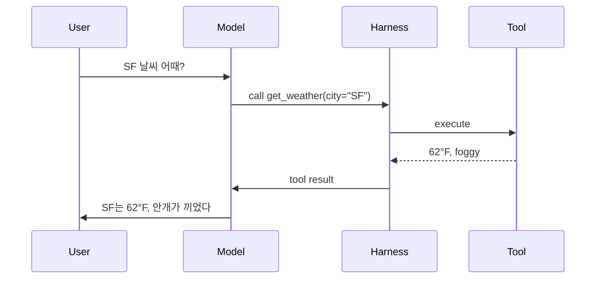
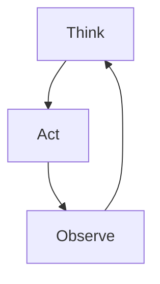
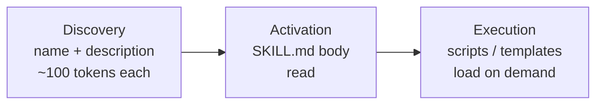
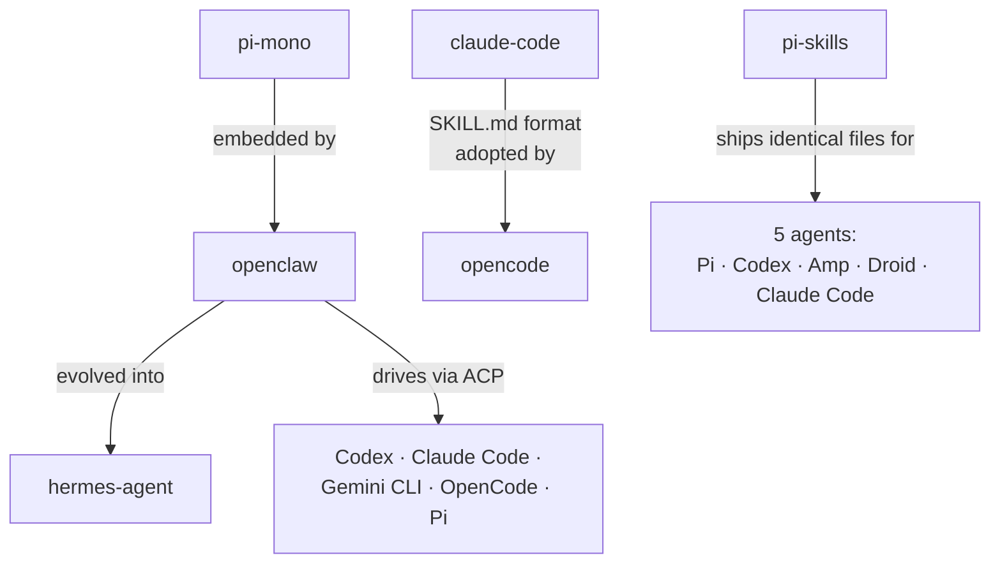
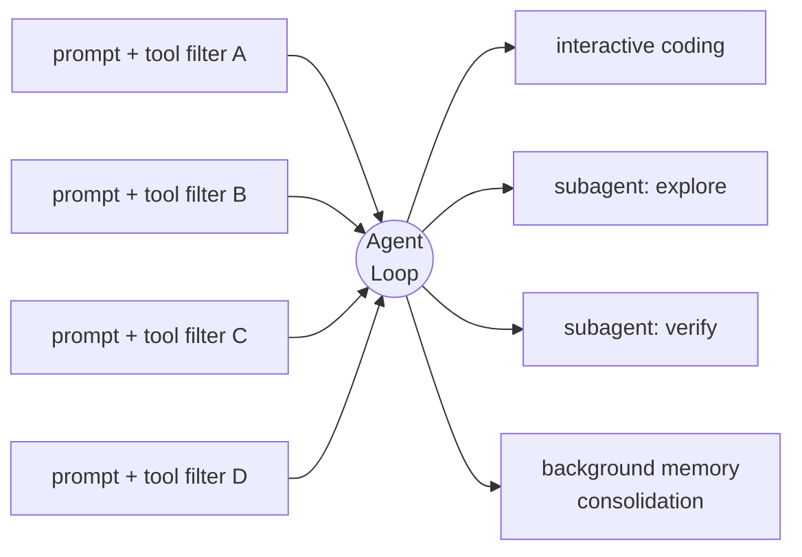
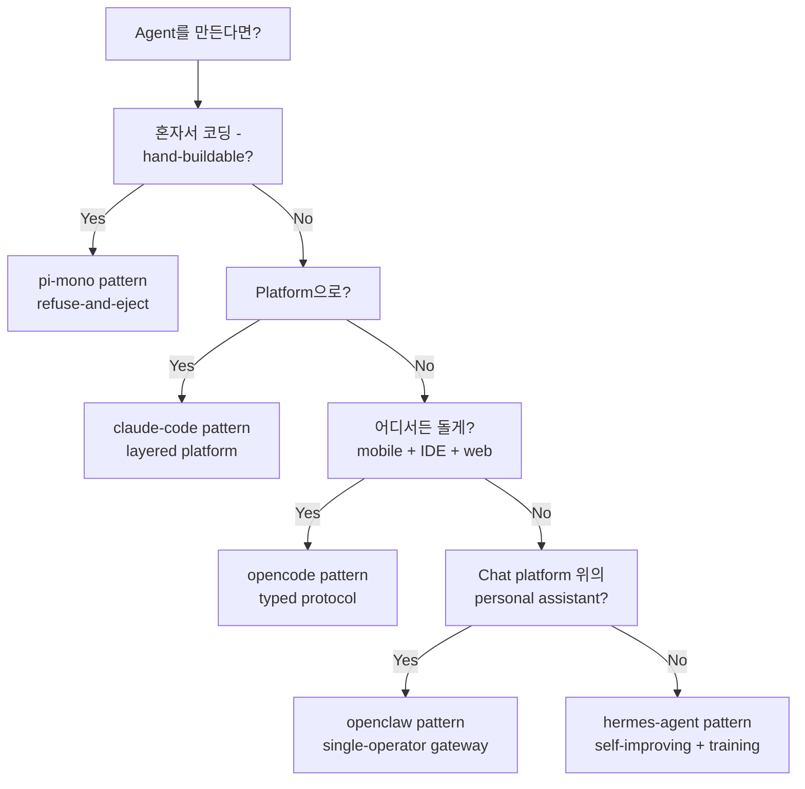

<!-- _class: lead -->

# Modern AI Agents

#### 어떻게 여기까지 왔고, 무엇이며, 어디서 갈리는가

<br>

발표자 · 2026-05

<!--
[발표 시 짚을 포인트]
- 자기소개는 한 문장이면 충분. 이 talk 자체가 credential이다.
- 시간 안내 — 35~40분 정도, 질문은 끝에 몰아서 받는다.
- 한 줄 약속: 이 talk이 끝날 때쯤이면, 오늘날 AI agents가 왜 다르고 어떻게 골라야 하는지 감이 잡힐 거다.
- AI 사전 지식은 필요 없다. 용어는 가는 길에 정의한다.

[전달 메모]
- 천천히 시작한다. 페이스는 후반으로 갈수록 올라간다.
-->

---

<!-- _class: lead -->

## 30초 요약 — 세 흐름이 하나로



<!--
[발표 시 짚을 포인트]
- AI agents는 하루아침에 등장한 단일 발명품이 아니다. 세 흐름이 거의 동시에 자랐고, 지금의 모습은 그 셋이 만나서 생긴 결과다.
- 공통 기반은 두 가지뿐: Transformer architecture (2017)와 chat-model interface (ChatGPT, 2022).
- 그 위에서 세 갈래가 병렬로 발전했다.
  - 모델이 "생각"하는 법을 배웠다 → reasoning이 별도의 출력 channel이 됐다
  - 모델이 "행동"하는 법을 배웠다 → tool use가 protocol이 됐다
  - 분야 전체가 그 둘을 "엮어내는" 법을 표준화했다 → orchestration frameworks, 이어서 cross-vendor standards
- 세 흐름이 모두 오늘의 "agents"로 수렴한다.
- 이 도식이 곧 talk 전체의 roadmap이다. 각 branch가 이후 한 section에 해당한다.

[전달 메모]
- linear timeline이 아니라 diamond shape인 이유를 짚어주면 좋다. linear로 그리면 거짓말이 된다. CoT (2022.01)는 사실 ChatGPT (2022.11)보다 먼저였고, WebGPT (2021.12)는 더 먼저다. 세 갈래는 sequential이 아니라 parallel.
-->

---

<!-- _class: lead -->

## 결론 먼저

<br>

> ### 2026의 AI agents는<br>**합의한 것이 훨씬 많고**<br>**남은 차이는 *editorial*이다**

<!--
[발표 시 짚을 포인트]
- punchline을 미리 던지는 슬라이드다. 청중이 어디로 가는지 알면 인지 부담이 크게 줄어든다.
- "editorial"이 뭔지 한 문장으로 풀어준다. 각 project가 *무엇을 거부하는가*, *무엇을 표준화하는가*, *trust boundary를 어디에 긋는가*, *agent가 자기 자신을 수정해도 되는가*. 이게 editorial이다.
- architecture는 안정화된 상태다. 남은 disagreement는 capability 차이가 아니라 *취향* 차이.
- 이 슬라이드와 마지막 슬라이드 사이의 모든 슬라이드가 이 주장을 증명하는 과정이다.

[전달 메모]
- 지금 defend하려고 하지 말 것. 나머지 슬라이드가 곧 defense다.
-->

---

# 모델, instruction을 따르기 시작하다

<div class="cols-2">
<div class="card">

**~ 2020**

<br>

<div class="mono">"오늘 날씨는..."</div>

<br>

다음 단어를 예측하는<br>정교한 autocomplete

</div>
<div class="card blue">

**2022 ~**

<br>

<div class="role-box">
<span class="role">user:</span> 메일 정리해줘
</div>
<div class="role-box">
<span class="role">assistant:</span> 어떤 기준으로?
</div>

<br>

지시를 받아 처리하는 *partner*

</div>
</div>

<div class="callout">
scale + instruction tuning + RLHF — 2020-2022
</div>

<!--
[발표 시 짚을 포인트]
- 2020년 이전의 language model은 사실상 정교한 autocomplete였다. 다음 단어를 예측하는 일이 전부였다.
- GPT-3 (2020)에서 흥미로운 사실이 드러났다. scale이 충분히 커지면, 같은 machinery가 자연어로 쓰인 *지시*를 따라준다.
- "completion engine"이 "지시를 따르는 agent"로 바뀐 건 세 가지가 합쳐진 결과다.
  - **scale** — parameter도 많고 data도 많다
  - **instruction tuning** — "지시받은 대로 답하라"는 예시로 fine-tune
  - **RLHF** — 사람이 선호한 답을 reward로 학습
- 핵심은 architecture가 바뀐 게 아니라는 것. *interface*가 바뀌었다. 모델의 형태는 그대로인데, 우리가 모델과 대화하는 방식이 달라졌다.
- ChatGPT (2022.11.30)는 이 변화가 누구에게나 보이게 된 순간이다.

[전달 메모]
- Transformer 내부나 scaling law는 깊이 들어가지 않는다.
- 이 슬라이드는 단 하나의 shift만 짚는다: completion → instruction.
-->

---

# Chat model의 세 가지 role

<br>

<div class="role-box">
<span class="role">system:</span> 모델에게 주는 규칙 (보이지 않는다)
</div>

<div class="role-box">
<span class="role">user:</span> 사용자가 입력하는 것
</div>

<div class="role-box">
<span class="role">assistant:</span> 모델이 답하는 것
</div>

<br>

<div class="callout">
모든 chat model의 universal API — Claude, ChatGPT, Gemini, Llama 동일
</div>

<!--
[발표 시 짚을 포인트]
- 모든 chat-tuned model이 같은 세 role을 쓴다. universal API다.
- **system** = 보이지 않는 instruction (규칙, persona, "너는 helpful한 assistant다")
- **user** = 사람이 입력하는 것
- **assistant** = 모델이 답하는 것
- 이 format은 OpenAI의 ChatGPT API (2023.03)에서 시작해 Anthropic, Google, Meta, Mistral, 모든 open-weight chat template이 그대로 따라갔다. cross-vendor의 lingua franca.
- 이후 talk에서 다룰 모든 것 — tool use, reasoning, agents — 이 세 role frame 안에서 일어난다. 모든 게 통과하는 keyhole.

[전달 메모]
- 여기가 vocabulary checkpoint다.
- 이 슬라이드 다음부터는 "system prompt"나 "tool message" 같은 용어를 설명 없이 써도 된다.
-->

---

# 모델, 생각하는 법을 익히다



<div class="callout">
이제 모델은 두 채널을 따로 내놓는다 — final answer + thinking trace
</div>

<!--
[발표 시 짚을 포인트]
- "Reasoning"이라는 단어는 거창하게 들리지만, 실은 짧고 단순한 두 단계 이야기다.
- **1단계 — prompt trick.** Wei et al. (2022.01)이 보여준 것: prompt에 reasoning을 풀어 쓴 example을 같이 넣으면, 모델이 그 style을 따라 하면서 math와 logic을 더 잘 푼다. Kojima et al. (2022.05)은 더 가벼운 사실을 보여줬다. "Let's think step by step" 한 줄만 붙여도 zero-shot으로 작동한다.
- **2단계 — trained capability.** 2024.09 OpenAI o1. reinforcement learning으로 긴 internal reasoning을 *학습*한 모델이다. 2025.01 DeepSeek-R1이 open-weights로 o1 수준을 따라잡았고, 2025.02 Claude도 extended thinking을 추가했다.
- 왜 중요한가? reasoning이 **별도의 출력 channel**이 됐다. 현대 모델은 private한 thinking trace와 final answer를 따로 내놓는다. 비용도 두 갈래, audience도 두 갈래 (개발자는 trace를 보고, 사용자는 답만 본다).
- 메커니즘은 평범하다. token이 길어진다 = 문제당 더 많은 compute. 중간 "thinking"이 forward pass에 작업 공간을 만들어주고, context window를 working memory처럼 활용하게 한다.

[전달 메모]
- 핵심은 *탈신비화*. Reasoning은 새로운 종류의 지능이 아니라, 같은 모델이 어려운 문제에 compute를 더 쓰는 것이다.
-->

---

# 모델, 도구를 잡다 — tools



<div class="callout">
Function calling — OpenAI, 2023.06.13
</div>

<!--
[발표 시 짚을 포인트]
- 순서를 짚어보자. 사용자가 질문하면, 모델이 *structured* tool call을 emit한다. 자유 텍스트가 아니라 JSON 모양의 request다. harness가 실행하고, 결과가 돌아오고, 모델이 final answer를 만든다.
- 결정적 날짜는 **2023.06.13** — OpenAI가 function calling을 ship한 날이다.
- 그 전에는 prompt에 "JSON 형식으로 출력해줘"라고 적고 기도하는 수밖에 없었다. 그 이후로 모델은 tool call을 별도 API field로 *학습된 상태*로 내놓는다.
- Anthropic이 따라왔고 (2023.11 beta → 2024.05 GA), Google도 2024년에 합류. 2024년 말이 되자 function calling은 사실상 기본 사양이 됐다.
- tool이 작동하면 모델은 거의 무엇이든 쓸 수 있다 — shell, browser, file editor, database, API.
- 이 단순한 cycle 하나 (model이 call → harness가 실행 → result 반환)가 모든 modern agent의 building block이 된다.

[전달 메모]
- 아직 "agent loop"라는 단어는 꺼내지 말 것. 다음 슬라이드에서 합친다.
- 이 슬라이드는 한 번의 trip이다. 다음 슬라이드가 그걸 cyclical로 만든다.
-->

---

# agent loop — 생각 · 행동 · 관찰



<div class="callout">
ReAct — Reasoning + Acting interleaved (Yao 2022)<br>
한 바퀴 = 한 번의 model call
</div>

<!--
[발표 시 짚을 포인트]
- 이제 슬라이드 6 (think)과 슬라이드 7 (act)을 합친다. 모델이 생각하고, 행동하고, 결과를 관찰하고, 다시 생각한다. task가 끝날 때까지 반복한다.
- 이 loop에 이름이 있다. **ReAct** — Reasoning + Acting의 줄임말이다. 2022년 Princeton/Google paper (Yao et al.).
- 한 바퀴 = model call 한 번. harness가 loop을 돌리고, 모델이 멈출 시점을 결정한다.
- 이게 **모든 modern AI agent의 spine**이다 — Claude Code, Cursor, ChatGPT with tools, AutoGPT, 모든 framework. surface는 달라도 loop은 같다.
- 여기서부터 모든 슬라이드는 이 loop을 *구현*하거나 (9~14), *특성화*하거나 (17~19), *configure*한다 (20~22).

[전달 메모]
- 청중에게 이 도식을 가리키며 한 마디. "지금 캡처해두세요. 이 모양이 이후 모든 슬라이드에 나옵니다."
-->

---

# 2023 — "agent"가 단어가 된 해

<div class="cols-2">
<div>

**Timeline**

- **2022.10** — LangChain
- **2022.11** — ChatGPT
- **2023.03.30** — AutoGPT *(13일에 30K stars; 4월 말 100K)*
- **2023.04.03** — BabyAGI
- **2023.08** — AutoGen, MetaGPT
- **2024.01** — CrewAI
- **2024.11.25** — MCP

</div>
<div class="card">

연구 paper에서 product category까지<br>**~5-6개월**

<br>

AutoGPT는 "AI agent"가 비전문가 사이에서 단어가 된 순간

<br>

다만, demo의 대부분은 cherry-pick.<br>2023년 가을이 되자 분위기는 *trough of disillusionment*로 뒤집힌다

</div>
</div>

<!--
[발표 시 짚을 포인트]
- agent loop이 연구 diagram에서 product category가 되기까지 약 5~6개월 — ReAct paper (2022.10) → AutoGPT (2023.03).
- **LangChain** (Harrison Chase, 2022.10.24)이 widely-used orchestration framework의 첫 사례. ChatGPT보다 한 달 먼저 나왔지만, ChatGPT 등장 직후 폭발적으로 자랐다.
- **AutoGPT** (Toran Bruce Richards, 2023.03.30)가 결정적 moment. 목표, memory, browsing, file editing이 다 들어 있는 "autonomous" agent다. 13일에 GitHub star 30K, 4월 말 100K — 당시 가장 빠르게 자란 open-source project.
- 이때를 기점으로 "AI agent"는 CEO도 아는 단어가 됐다.
- 뒤이어 **BabyAGI** (2023.04.03), **AutoGen** (Microsoft, 2023.08), **MetaGPT** (2023.08), **CrewAI** (2024.01) — multi-agent framework들이 layer로 쌓였다.
- 솔직히 짚자면, AutoGPT demo의 상당수는 cherry-pick이다. 실제 run은 loop에 갇히고, hallucinate하고, 진짜 돈을 썼다. 2023년 가을이 되자 분위기는 "trough of disillusionment"로 돌아섰다.

[전달 메모]
- AutoGPT의 기여는 *technical*이 아니라 *cultural*이었다 — agent의 *모양*을 전 세계에 보여줬다.
- 신뢰성 문제는 이후 2년이 더 걸렸다 (model 발전, tool API 정비, MCP).
-->

---

# 그 시기가 남긴 것

<div class="cols-2">
<div class="card">

**살아남은 lesson**

- Own your prompts
- Own your context
- Own your control flow

<br>

— *12-Factor Agents* 학파

</div>
<div class="card blue">

**MCP, 그리고 마침표**

<br>

framework war는 결국<br>**orchestration이 아니라**<br>**integration을 표준화하면서** 끝난다

<br>

— *2024.11*

</div>
</div>

<!--
[발표 시 짚을 포인트]
- Orchestration framework (LangChain, AutoGen, CrewAI, MetaGPT)들이 2023년 내내 시끄러웠지만, 2024년쯤 되자 분위기가 정리된다. *framework들이 너무 over-abstract였고, orchestration layer는 사실 문제의 가장 작은 부분이다.*
- 여기서 나온 production wisdom — "12-Factor Agents" 학파:
  - **Own your prompts** — framework abstraction 뒤에 숨기지 말 것
  - **Own your context** — 매 턴 무엇이 window에 들어갈지는 *네가* 결정
  - **Own your control flow** — loop은 직접 써라. loop은 작다
- framework war는 모두가 *orchestration*은 작고 *integration*이 크다는 데 동의하면서 끝났다. MCP (2024.11)가 표준화한 게 후자다 — agent와 tool을 어떻게 연결하느냐. agent를 어떻게 만드느냐가 아니라.
- framework era에서 살아남은 건 **mental model**이다 (agent = loop + tools + memory + objective). framework 자체는 후퇴.

[전달 메모]
- 청중에게 한 마디: "agents를 이해하려고 LangChain을 배울 필요는 없습니다." pattern은 library를 초월한다.
-->

---

# 모델을 조종하는 두 축

<div class="cols-2">
<div class="card red">

### Constrain
원치 않는 행동을 *막는다*

<br>

- refuse / content filters
- sandbox
- permission prompts

</div>
<div class="card blue">

### Steer
원하는 방향으로 *몰아간다*

<br>

- system prompt (role pinning)
- structured output
- tool-registry trimming
- verdict contract

</div>
</div>

<div class="callout">
지키라고 부탁하지 말고, 어길 능력 자체를 제거해라
</div>

<!--
[발표 시 짚을 포인트]
- 강력한 generalist model을 어떻게 task에 붙들어두면서 — 동시에 trouble에서 떼어놓을까? 두 가지 보완적인 축이 있다.
- **Constrain** (negative axis): 원치 않는 행동을 막는다. refusal training, output filter, sandbox, 위험한 action 직전의 permission prompt.
- **Steer** (positive axis): 정해진 purpose 쪽으로 끌어간다. system prompt (agent의 직무 기술서), structured output (JSON schema 강제), tool denylist (위험한 tool은 *아예 빼버린다*), verdict contract ("PASS or FAIL로 끝내라").
- 지난 1년 가장 인상적인 design move는 이거였다. **규칙을 부탁하지 말고, 어길 능력 자체를 빼버려라.** Claude Code의 read-only reviewer subagent에는 `Edit` tool이 *없다*. 규칙이 prompt 한 줄이 아니라 *부재한 capability*다. 모델이 literally 위반할 수가 없다.
- 두 축이 함께 작동한다. sandbox는 *외부 세계*를 모델에게서 지키고, structural denylist는 *task*를 모델이 옆길로 새는 것에서 지킨다.

[전달 메모]
- 이게 deck에서 가장 중요한 *editorial* idea다.
- 청중이 새 mental model 딱 하나만 가져간다면, 이걸 가져가야 한다. purpose는 prompt가 *말하는* 게 아니라 모델이 *가진* tool이 enforce한다.
-->

---

# 2024-2025, 표준이 자리잡은 12개월

<div class="cols-4">
<div class="card blue">

**MCP**
*tool bridge*

<br>

Anthropic<br>
2024.11.25

</div>
<div class="card blue">

**AGENTS.md**
*project context*

<br>

OpenAI Codex CLI<br>
2025 중반

</div>
<div class="card blue">

**ACP**
*editor bridge*

<br>

Zed<br>
2025.08.27

</div>
<div class="card blue">

**SKILL.md**
*capability artifact*

<br>

Anthropic<br>
2025.10.16

</div>
</div>

<br>

<div class="callout">
12개월에 cross-vendor standards 네 개
</div>

<!--
[발표 시 짚을 포인트]
- 12개월 안에 cross-vendor standard 네 개. 어떤 software 분야에서도 드문 일이고, AI에서는 사실상 전례가 없다.
- **MCP** (Model Context Protocol, Anthropic, 2024.11.25): agent가 *tool과 data source*와 대화하는 protocol. 첫날부터 open-source. OpenAI가 2025.04에 채택했고, 2025.12에 Linux Foundation으로 donate.
- **AGENTS.md** (2025 중반, OpenAI Codex CLI): project가 agent에게 자기 자신을 소개하는 plain Markdown 파일. Git처럼 project root → cwd로 walk한다. 2025년 말 Linux Foundation으로 donate; 2026년 초 기준 약 60K open-source project가 사용한다.
- **ACP** (Agent Client Protocol, Zed, 2025.08.27): *editor*가 *agent*에게 말하는 방법. LSP가 language server에 한 역할을 ACP가 agent에 한다 — 어느 editor든 어느 agent에든 붙는다.
- **SKILL.md** (Anthropic Claude Skills, 2025.10.16; agentskills.io 표준 2025.12.18): 어디서든 작동하는 capability bundle. Markdown + YAML frontmatter + optional script.
- 각각이 minimal하다 — text 한 장이거나 JSON-RPC 한 줄. 그 단순함이 adoption을 마찰 없게 만들었다.

[전달 메모]
- adoption의 *규모*를 강조한다. 표준 네 개, 모든 major vendor (Anthropic, OpenAI, Google, Microsoft, Meta, 수십 개 CLI와 editor), 1년.
- 우연이 아니다. field가 *준비된 상태*였다.
-->

---

# 세 protocol, 세 layer — 각자 자기 일

<br>

<div style="font-family: 'JetBrains Mono', monospace; font-size: 0.95em; line-height: 1.8;">

<div class="card">

📝 **Editor** *(Zed, VS Code, …)*

⬇️  ACP

🤖 **Agent** *(Claude Code, opencode, …)*

⬇️  MCP

🔧 **Tools / Resources** *(server들)*

</div>

</div>

<br>

<div class="callout">
LSP가 language server를 했다면, ACP는 agent를, MCP는 tool을 한다
</div>

<!--
[발표 시 짚을 포인트]
- 세 protocol, 세 layer, 세 job. 각자 minimal하고 composable하다.
- **Editor ↔ Agent: ACP.** Zed 같은 editor를 열었을 때, AI sidebar가 Claude Code와 통신하는 게 이것이다.
- **Agent ↔ Tools: MCP.** agent가 GitHub를 검색하거나 database에 query를 날릴 때 쓰는 게 이것이다.
- 2026년의 전형적인 setup은 이렇다. Zed (editor)가 Claude Code (agent)에 ACP로 말하고, Claude Code가 GitHub server, Postgres server, Slack server에 MCP로 말한다.
- 어느 layer의 vendor도 다른 layer를 건드리지 않고 swap이 가능하다. LSP가 language server에서 했던 일과 같은 모양 — composable한 plumbing.

[전달 메모]
- 청중이 LSP를 알면 (VS Code/Vim 등의 code intelligence를 가능하게 한 그 IDE↔language-server protocol) — analogy를 바로 가져다 쓴다. "ACP가 agent에 대해, LSP가 language server에 한 역할을 한다."
- 모르는 청중이라면 두 surface를 그냥 묘사한다. "editor가 agent와 protocol 하나로 대화하고, agent가 tool과 또 다른 protocol로 대화한다."
-->

---

# Skill — 어디서든 도는 capability 파일



<div class="cols-2">
<div>

**Progressive disclosure**

30 skills × ~100 tokens<br>≈ **3K tokens** startup

vs

30 skills × ~2,000 tokens<br>≈ **60K tokens** eager load

</div>
<div class="callout">
같은 SKILL.md 파일이<br>Claude Code / Codex / Cursor /<br>OpenCode / Pi / Goose에서 그대로 돈다
</div>
</div>

<!--
[발표 시 짚을 포인트]
- Skill은 그냥 폴더다. 안에 `SKILL.md` 한 장 (Markdown + 두 줄짜리 YAML header: name + description + 자유 형식의 instruction)이 들어 있고, 옆에 `scripts/` 디렉터리가 있을 수도 있다.
- 핵심 혁신은 **progressive disclosure** — 세 단계로 나뉜다.
  - **Discovery**: startup 시점에 agent는 각 skill의 name과 description만 본다 (~100 token 정도씩).
  - **Activation**: 모델이 skill이 필요하다고 판단하면, full body를 읽는다.
  - **Execution**: body가 script나 template를 참조할 때만 그걸 연다.
- 숫자로 보자. 30 skills × 100 tokens at startup ≈ 3K. 같은 30개를 eager load하면 ~60K tokens — *사용자가 한 글자 입력하기도 전에*. progressive disclosure가 수십 개 skill을 ship하는 걸 가능하게 만든다.
- 같은 SKILL.md 파일이 Claude Code, Codex CLI, Cursor, OpenCode, Pi, Goose, 그리고 약 25개의 다른 tool에서 그대로 작동한다. 그냥 Markdown이니까.
- 이게 이 분야에서 가장 깊은 interop story다 — *capability*까지 portable해졌다 (model만이 아니라).

[전달 메모]
- 강조: portability를 만든 건 minimalism이었다. Markdown은 상상할 수 있는 가장 평범한 format이고, 그래서 퍼졌다.
-->

---

# 다섯 agent, 다섯 가지 editorial 선택

<div class="cols-5">

<div class="card">

**claude-code**

Anthropic

🖥️ terminal

<br>

*the layered platform*

</div>

<div class="card">

**opencode**

SST

🖥️🌐 terminal + web

<br>

*typed protocol surface*

</div>

<div class="card">

**pi-mono**

badlogic

🖥️ terminal

<br>

*refuse-and-eject<br>minimalism*

</div>

<div class="card">

**hermes-agent**

Nous Research

💬 multi-channel

<br>

*self-improving<br>training env*

</div>

<div class="card">

**openclaw**

community

💬 multi-channel

<br>

*single-operator<br>gateway*

</div>

</div>

<!--
[발표 시 짚을 포인트]
- 이 다섯이 talk 나머지의 grounding이다. 계속 돌아온다.
- **claude-code** (Anthropic): reference implementation. 모든 게 markdown + frontmatter다. MCP-first. ~40개 built-in tool, layered permission, 사방에 hook.
- **opencode** (SST): server-first. agent가 typed HTTP API 뒤에 살고, terminal UI는 client *중 하나*일 뿐이다. model catalog를 `models.dev`에서 live로 끌어온다.
- **pi-mono** (Mario Zechner): tool 7개. *No* MCP, *no* subagent, *no* permission popup. 나머지는 다 extension. 원칙적으로 거부한다.
- **hermes-agent** (Nous Research): self-improving. agent가 자기 memory를 편집하고 skill을 만든다. 동시에 다음 model을 위한 training environment.
- **openclaw** (community): operator 한 명, 세 단계 Docker sandbox, multi-channel daemon. agent runtime으로 *pi-mono*를 그대로 embed한다.
- 청중이 다섯을 외울 필요는 없다. 핵심은 *각자가 다른 editorial 선택을 했다는 것*. 그 선택이 다음 슬라이드 주제다.

[전달 메모]
- canonical name보다는 *예시*로 land시킨다.
- 이 project들이 representative하는 *선택*이 project 자체보다 중요하다.
-->

---

# 다섯의 family tree



<div class="callout">
표준이 실제로 동작한다는 증거 — ecosystem이 정말로 compose된다
</div>

<!--
[발표 시 짚을 포인트]
- ecosystem은 isolated된 project 다섯이 아니다. 서로 코드를 나눠 쓰고, format을 공유하고, 의존한다.
- **openclaw**는 agent loop을 reinvent하지 않는다. pi-mono를 library로 import해서 그 위에 session lane, sandbox, multi-channel routing을 얹는다.
- **hermes-agent**는 `hermes claw migrate`라는 명령어를 ship한다. 사용자의 `~/.openclaw` 디렉터리를 import한다. hermes는 openclaw에서 자라났다.
- **opencode**는 `~/.claude/skills/`를 그대로 읽는다. provider-agnosticism이 *artifact*까지 확장됐다 (model만이 아니라).
- **pi-skills** (community skill collection)는 다섯 agent용 install instruction과 함께 *동일한* SKILL.md 파일을 ship한다 — Pi, Codex, Amp, Droid, Claude Code.
- **openclaw**는 ACP를 양방향으로 쓴다. IDE를 위한 ACP server인 동시에, `acpx` extension으로 Codex / Claude Code / Gemini CLI / OpenCode / Pi를 *nested child*로 *drive*한다.
- 각 cross-reference가 **표준이 진짜고 ecosystem이 compose된다**는 증거다. "competition table"이 아니라 "family tree".

[전달 메모]
- 이 슬라이드가 다음에 나오는 universals 슬라이드의 근거가 된다.
- 표준이 있다고 *말*하면서 실제 interop을 *보여주면*, abstraction이 credible해진다.
-->

---

# One loop, many policies



<div class="callout">
multi-agent는 별도 platform이 아니다 — 같은 loop을 다르게 configure한 것
</div>

<!--
[발표 시 짚을 포인트]
- 이게 분야에서 **가장 universal한 pattern**이다. 우리가 본 다섯 agent 전부에 걸쳐 있다.
- 같은 `while (true) { call model; run tools }` loop. 위에 다른 policy: 다른 prompt, 다른 tool filter, 다른 permission context.
- claude-code의 소스에서 *파일 하나* (`query.ts`)가 다음을 전부 처리한다 — interactive REPL, headless SDK call, 모든 종류의 subagent, remote session, background memory consolidation. 다 같은 loop의 configuration이다.
- 구체적 예. "verify" subagent는 같은 loop이지만 mutating tool을 제거한 denylist + "구현을 깨뜨려봐라"는 prompt + "VERDICT: PASS or FAIL로 끝내라"는 contract가 붙는다. "explore" subagent는 같은 loop이지만 read-only tool만 쥐여준다.
- Slogan: **multi-agent behavior는 별도 platform이 아니라, 같은 loop을 다르게 configure한 것이다.**

[전달 메모]
- 이 말을 또박또박 천천히. "Subagent는 별도 engine이 아닙니다."
- 듣는 사람의 다음 agent design을 바꿀 만한 insight다.
-->

---

# 다섯이 합의하는 것 — universals

<div class="cols-2">
<div>

✅ One loop, many policies

✅ Methodology in prompts, not state

✅ Compaction as control flow

</div>
<div>

✅ Streaming + parallel tool execution

✅ SKILL.md + AGENTS.md as<br>cross-vendor artifacts

✅ ACP for editors, MCP for tools

</div>
</div>

<div class="callout">
universals = 이제 더 이상 흥미롭지 않은 부분
</div>

<!--
[발표 시 짚을 포인트]
- 이 여섯 pattern이 다섯 agent *전부*에서 나타난다. 더 이상 흥미롭지 않다 — 즉, designer들이 더 이상 differ하지 않는 곳.
- **One loop, many policies** — 슬라이드 17의 finding.
- **Methodology in prompts, not state** — code에 rigid한 "phase 1 / phase 2" state machine이 없다. model이 active sequencer고, runtime은 그 선택을 safe하게 만드는 역할.
- **Compaction as control flow** — context window 관리가 특별한 feature가 아니라 매 턴의 일부다. (claude-code는 매 model call 직전에 다섯 단계 compaction을 돌린다.)
- **Streaming + parallel tool execution** — tool이 model token output과 동시에 돌고, 한 턴에 여러 tool이 한꺼번에 dispatch된다.
- **SKILL.md + AGENTS.md** — capability와 project context를 위한 cross-vendor 파일 convention.
- **ACP for editors, MCP for tools** — 두 cross-vendor protocol.
- "uninteresting" framing은 사실 positive한 이야기다. 안정된 foundation이 있어야 designer가 *흥미로운 차이*에 집중할 수 있다. 그게 다음 슬라이드 주제.

[전달 메모]
- 이 list는 가독성을 위해 추린 것이다.
- universal이 더 있다 (recovery as control flow, prefix-cache discipline, pattern-rule permissions 등). 물어보면 언급한다.
-->

---

# 다섯이 갈리는 지점 — rifts

<br>

<table>
<tr>
<th>축</th><th>한쪽 극</th><th>다른 쪽 극</th>
</tr>
<tr><td>Process model</td><td>server-first</td><td>binary-first</td></tr>
<tr><td>MCP</td><td>load-bearing</td><td>deliberately refused</td></tr>
<tr><td>Sandbox</td><td>in core</td><td>your problem</td></tr>
<tr><td>Memory</td><td>layered + curator</td><td>none in core</td></tr>
<tr><td>Subagents</td><td>first-class</td><td>refused</td></tr>
<tr><td>Trust frame</td><td>multi-tenant</td><td>one-operator</td></tr>
</table>

<div class="callout">
전부 architectural이 아니라 editorial — 한쪽을 택하면 나머지 결정이 따라온다
</div>

<!--
[발표 시 짚을 포인트]
- 다섯 agent가 structurally disagree하는 여섯 지점.
- **Server-first vs binary-first.** agent가 daemon인가 (opencode, hermes, openclaw), single binary인가 (claude-code, pi-mono). multi-surface (mobile, IDE, chat)가 거의 공짜로 따라오는지를 결정한다.
- **MCP load-bearing vs refused.** 다섯 중 셋이 MCP를 core에 넣었고, 둘은 명시적으로 거부한다 (pi-mono, openclaw). 거부는 ignorance가 아니라 *position*이다.
- **Sandbox in core vs your problem.** openclaw는 세 단계 Docker sandbox를 ship한다. pi-mono는 명시적으로 user에게 떠넘긴다.
- **Memory layered + curator vs none.** hermes-agent는 stale skill을 auto-archive하는 curator가 있는 4-layer memory. pi-mono는 learned memory가 0. claude-code는 그 중간.
- **Subagents first-class vs refused.** claude-code는 ~6개의 built-in subagent type을 ship한다. pi-mono는 subagent를 완전히 거부한다.
- **Multi-tenant vs one-operator.** openclaw는 *user 한 명, host 한 대*를 명시적으로 가정한다. 나머지는 implicit하게 multi-tenant.
- 이 선택들은 right-or-wrong이 아니다 — *editorial*이다. 각 agent가 한쪽을 택하고, 그 선택이 나머지 결정 대부분을 예측한다.

[전달 메모]
- 위계를 암시하지 않도록 조심한다. "Refusal"이 negative하게 들릴 수 있지만, pi-mono가 MCP를 거부한 건 design goal에 부합하는 deliberate한 선택이다. openclaw가 agent hierarchy를 거부한 것도 마찬가지다.
-->

---

# 2026의 AI agent — 표준 골격

<br>

```
┌───────────────────────────────────────────────────┐
│  Surface  (TUI · chat · IDE · …)                  │
├───────────────────────────────────────────────────┤
│  Session  (history · compaction · retry)          │
├───────────────────────────────────────────────────┤
│  Loop     (prompt → model → tools → result)       │
├───────────────────────────────────────────────────┤
│  Provider · Tools · Permissions                    │
├───────────────────────────────────────────────────┤
│  Extensions  (MCP · Skills · Plugins · Hooks)     │
└───────────────────────────────────────────────────┘
```

<div class="callout">
streaming chat loop + tools + permissions + extensions —<br>
prompt + tool filter + permission policy를 바꿔 여러 runtime으로 configure
</div>

<!--
[발표 시 짚을 포인트]
- 모든 modern AI agent의 한 장짜리 도식이다.
- **Surface** — 사람이 보는 곳 (terminal, IDE, chat app, mobile, web).
- **Session** — durable한 conversation state. history와 compaction 포함.
- **Loop** — 슬라이드 8의 recurring spine.
- **Provider / Tools / Permissions** — model API, tool registry, agent가 무엇을 할 수 있는지에 대한 규칙.
- **Extensions** — MCP server, skill, plugin, agent-specific config.
- 우리가 본 다섯 agent 전부 이 모양에 들어맞는다. 다른 건 *각 layer가 어떻게 build됐는가*이지, *layer가 있느냐 없느냐*가 아니다.
- 한 줄 정의: *"streaming chat loop over a provider abstraction, with tools, permissions, and extensions — configurable into many runtimes by changing prompt + tool filter + permission policy."*

[전달 메모]
- 슬라이드 8의 loop을 다시 가리킨다. 같은 loop인데 이제 더 큰 stack에 embed된 모습이다.
-->

---

# 당신은 어떤 problem class에 있나



<!--
[발표 시 짚을 포인트]
- "Best" agent는 없다. 다섯 problem class에 다섯 pattern이 있을 뿐이다.
- **혼자서 코딩, hand-buildable** → pi-mono pattern. tool 7개, no MCP, refuse-and-eject. simple, opinionated, fast.
- **Coding agent를 platform으로** → claude-code pattern. layered platform, MCP-first, 모든 게 markdown + frontmatter. ecosystem을 염두에 둔다.
- **어디서든 도는 coding agent** → opencode pattern. server-first, typed HTTP API, 여러 client (terminal, web, mobile, IDE).
- **chat platform 위의 personal assistant** → openclaw pattern. single-operator gateway, multi-channel daemon, Docker-tiered sandbox.
- **self-improving + training environment** → hermes-agent pattern. skill을 auto-archive하는 curator, trajectory generation을 위한 batch-runner. agent가 자기 자신의 training distribution이 된다.
- 올바른 질문은 "어떤 agent가 best인가"가 아니다. **"내가 어떤 problem class에 있는가"** — 그 답이 pattern을 골라준다.

[전달 메모]
- 여기서 deck이 thesis를 cash한다.
- 슬라이드 19의 rift들이 *problem class와 correlate*한다 — 그래서 disagreement가 editorial이지 architectural이 아니라는 것.
-->

---

# 2026에 agent를 만든다면 — 기본 10가지

<div class="cols-2">
<div>

1. Streaming chat loop
2. Tool registry + schema 검증
3. SKILL.md loader
4. AGENTS.md walk
5. Compaction stage

</div>
<div>

6. Permissions OR sandbox
7. MCP (또는 명시적 refusal)
8. ACP server
9. Durable session store
10. Subagent affordance

</div>
</div>

<br>

<div class="callout">
어느 것도 reinvent할 필요 없다 — 우리가 본 다섯 project 중 어딘가에는 다 있다<br>
흥미로운 일은 <strong>너의 문제 class에 어떤 pattern이 중요한지 고르고, 나머지는 거부하는 것</strong>이다
</div>

<!--
[발표 시 짚을 포인트]
- 2026에 처음부터 agent를 만든다면, 이 정도가 floor다.
- 각 item이 **현재의 expectation**이지 aspirational feature가 아니다.
- 10개를 짧게 짚어보면:
  1. streaming model+tool loop
  2. schema validation이 있는 tool registry
  3. SKILL.md loader
  4. cwd → root로 AGENTS.md walk
  5. compaction stage
  6. permissions OR sandbox
  7. MCP support 또는 명시적 refusal
  8. ACP server
  9. durable session store
  10. subagent affordance
- 어느 것도 invent할 필요 없다. 우리가 본 다섯 project *최소 하나*에 다 있다 — 대부분은 *모두*에 있다.
- 2026의 흥미로운 작업은 이걸 reinvent하는 게 아니다. **너의 problem class에 어떤 pattern이 중요한지 고르는 것**이다 — 그리고 나머지는 거부하는 것.

[전달 메모]
- 여기서 짧게 한 호흡 멈춤. 이 슬라이드가 talk의 practical takeaway다.
- 만들러 가는 사람이 있다면, 이 checklist를 가져가게 한다.
-->

---

<!-- _class: lead -->

# Closing

<br>

> Agents agree more than they disagree.

> 남은 차이는 *editorial*이다 —<br>무엇을 거부하고, 무엇을 표준화하고,<br>trust boundary를 어디에 긋는가.

> ### Pick yours.

<br>

<div class="small muted">
docs corpus: per-agent docs · comparison · research · references
</div>

<!--
[발표 시 짚을 포인트]
- 마지막으로 thesis를 다시. agents agree more than they disagree.
- architecture는 settled. 남은 rift들 — 무엇을 거부하고, 무엇을 표준화하고, trust boundary를 어디에 긋고, agent가 자기 자신을 편집해도 되는지 — 다 capability가 아니라 *취향*의 문제다.
- editorial 선택을 잘못 했을 때의 비용은 2022년보다 2026년이 훨씬 작다. 밑의 substrate가 훨씬 단단해졌으니까.
- docs corpus 짧게 언급 (per-agent doc, comparison, research, references). 어디서 찾을 수 있는지.
- 감사. 질문 받기.

[전달 메모]
- 여기서 새 material 도입 금지.
- 이 슬라이드의 job은 thesis를 청중이 들고 나갈 한 호흡으로 압축하는 것이다.
-->
